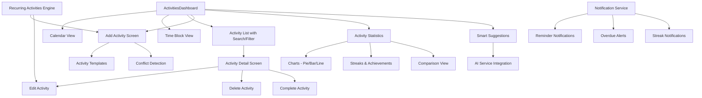
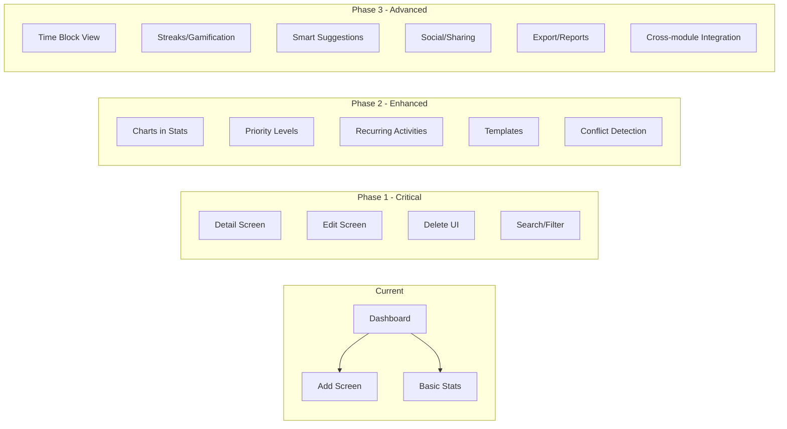

# 📋 Activities Module Development Plan

## Current State Analysis

The activities module currently consists of 3 screens:

| Screen | File | Description |
|--------|------|-------------|
| Dashboard | [`activities_dashboard.dart`](lib/screens/activities/activities_dashboard.dart:11) | Calendar + day-based activity list |
| Statistics | [`activity_statistics.dart`](lib/screens/activities/activity_statistics.dart:7) | Basic daily/weekly/monthly stats (numbers only, no charts) |
| Add Activity | [`add_activity_screen.dart`](lib/screens/activities/add_activity_screen.dart:9) | Form to create new activities |

**Backend API** [`activity_api.dart`](lib/services/activity_api.dart:8) already supports:
- CRUD operations (Create, Read, Update, Delete)
- Complete activity (PATCH)
- Daily/Weekly/Monthly stats
- Upcoming activities
- Categories

**Model** [`Activity`](lib/models/activity_model.dart:185) has: title, description, category, startTime, endTime, isCompleted, hasReminder, reminderMinutes, notes

---

## 🔴 Critical Gaps (API exists, UI missing)

These features have backend support but no frontend implementation:

1. **Edit Activity Screen** — [`ActivityService.updateActivity()`](lib/services/activity_api.dart:203) exists but is never called from any screen
2. **Delete Activity** — [`ActivityService.deleteActivity()`](lib/services/activity_api.dart:263) exists but no UI trigger
3. **Activity Detail View** — [`ActivityService.getActivityById()`](lib/services/activity_api.dart:139) exists but no detail screen
4. **Upcoming Activities View** — [`ActivityService.getUpcomingActivities()`](lib/services/activity_api.dart:115) exists but unused

---

## 🟡 Essential Improvements (High Priority)

### 1. Activity Detail Screen
**New file:** `activity_detail_screen.dart`

- Full activity information display
- Status timeline (upcoming → ongoing → completed)
- Quick actions: edit, delete, complete, toggle reminder
- Activity duration visualization
- Swipe-to-complete gesture

### 2. Edit Activity Screen
**New file:** `edit_activity_screen.dart` (or extend `add_activity_screen.dart`)

- Reuse the add form but pre-populate with existing data
- Call [`ActivityService.updateActivity()`](lib/services/activity_api.dart:203)
- Support rescheduling (change start/end times)
- Update reminder notification when time changes

### 3. Delete Activity Confirmation
- Add delete option in activity card long-press menu or detail screen
- Confirmation dialog before deletion
- Call [`ActivityService.deleteActivity()`](lib/services/activity_api.dart:263)
- Cancel scheduled notification on delete

### 4. Search & Filter
- Search bar in dashboard for finding activities by title
- Filter by: category, status (completed/upcoming/ongoing), date range
- Sort by: time, category, status

### 5. Enhanced Statistics with Charts
**Improve:** [`activity_statistics.dart`](lib/screens/activities/activity_statistics.dart:7)

- Add pie chart for category distribution (use `fl_chart` package)
- Add bar chart for weekly completion rates
- Add line chart for monthly trends
- Streak counter (consecutive days with all activities completed)
- Comparison view (this week vs last week)

---

## 🟢 Feature Additions (Medium Priority)

### 6. Priority Levels
**Model change:** Add `priority` field to [`Activity`](lib/models/activity_model.dart:185)

- Priority enum: `low`, `medium`, `high`, `urgent`
- Color-coded indicators on activity cards
- Priority-based sorting option
- Backend: add `priority` column to activities table

### 7. Recurring Activities
**Model change:** Add `recurrence` field to [`Activity`](lib/models/activity_model.dart:185)

- Recurrence types: daily, weekly, monthly, custom
- End date for recurrence or indefinite
- Auto-generate future activity instances
- Edit single occurrence vs edit all occurrences

### 8. Activity Templates
**New file:** `activity_templates_screen.dart`

- Pre-defined templates for common activities (work shift, gym session, study block)
- Custom template creation from existing activity
- Quick-add from template (pre-fills title, category, times, reminder)
- Template management (create, edit, delete)

### 9. Conflict Detection
- Warn when new activity overlaps with existing one
- Visual overlap indicator on calendar
- Suggest alternative time slots
- Show conflicting activities in a warning dialog

### 10. Activity Notes Enhancement
- Rich text notes (bold, lists, links)
- Attach photos to activity notes
- Voice note recording option
- Checklist within notes (subtasks)

---

## 🔵 Advanced Features (Lower Priority)

### 11. Time Blocking View
**New file:** `time_block_view_screen.dart`

- Day view as time blocks (like Google Calendar)
- Visual timeline showing activity durations
- Drag-and-drop rescheduling
- Empty time slots highlighted for planning

### 12. Activity Streaks & Gamification
- Daily streak counter (consecutive days with 100% completion)
- Weekly achievement badges
- Progress ring showing completion rate
- Motivational messages based on streaks
- Integration with existing achievements system

### 13. Smart Suggestions
- AI-powered activity suggestions based on patterns
- Suggest optimal time slots based on historical data
- Suggest categories based on day of week patterns
- Integration with [`ai_service.dart`](lib/services/ai_service.dart)

### 14. Activity Sharing & Social
- Share activity schedule with family members
- Group activities (shared with other users)
- Community activity challenges (like walking challenges)
- Integration with [`community_api.dart`](lib/services/community_api.dart)

### 15. Export & Reports
- Weekly/Monthly PDF report generation
- Export activities to CSV
- Share statistics screenshot
- Integration with [`export_service.dart`](lib/services/export_service.dart)

### 16. Integration with Other Modules
- Link activities to symptoms (how activities affect health)
- Link activities to medications (take medication during activity)
- Activity impact on water intake needs
- Activity impact on nutrition planning
- Cross-module insights in AI dashboard

---

## 🏗️ Proposed Architecture





---

## 📁 Proposed New File Structure

```
lib/screens/activities/
├── activities_dashboard.dart          ← Enhanced with search/filter
├── activity_detail_screen.dart        ← NEW: Full detail view
├── activity_statistics.dart           ← Enhanced with charts
├── add_activity_screen.dart           ← Enhanced with templates
├── edit_activity_screen.dart          ← NEW: Edit existing activity
├── activity_templates_screen.dart     ← NEW: Template management
├── time_block_view_screen.dart        ← NEW: Timeline day view
├── widgets/                           ← NEW: Shared activity widgets
│   ├── activity_card.dart             ← Extracted from dashboard
│   ├── activity_status_badge.dart     ← NEW: Status indicator
│   ├── activity_priority_indicator.dart ← NEW: Priority visual
│   ├── category_selector.dart         ← Extracted from add screen
│   ├── conflict_warning_dialog.dart   ← NEW: Overlap warning
│   ├── search_filter_bar.dart         ← NEW: Search & filter
│   └── streak_counter.dart            ← NEW: Gamification widget
```

---

## 🔧 Required Model Changes

### Activity model additions ([`activity_model.dart`](lib/models/activity_model.dart:185))

```dart
// New fields to add:
enum ActivityPriority { low, medium, high, urgent }

enum RecurrenceType { none, daily, weekly, monthly, custom }

class Activity {
  // ... existing fields ...
  final ActivityPriority priority;        // NEW
  final RecurrenceType recurrence;        // NEW
  final DateTime? recurrenceEndDate;      // NEW
  final int? recurrenceInterval;          // NEW (e.g., every 2 weeks)
  final String? recurrenceRule;           // NEW (custom RRule string)
  final int? templateId;                  // NEW (link to template)
  final List<String>? subtasks;           // NEW (checklist items)
  final String? attachmentUrl;            // NEW (photo attachment)
}
```

### Backend model additions ([`back/models.py`](back/models.py:734))

```python
class Activity(Base):
    # ... existing columns ...
    priority = Column(String(20), default="medium")      # NEW
    recurrence_type = Column(String(20), default="none")  # NEW
    recurrence_end_date = Column(Date, nullable=True)     # NEW
    recurrence_interval = Column(Integer, nullable=True)  # NEW
    template_id = Column(Integer, nullable=True)          # NEW
```

---

## 📦 Required Package Additions

| Package | Purpose |
|---------|---------|
| `fl_chart` | Pie, bar, and line charts for statistics |
| `flutter_slidable` | Swipe actions on activity cards (complete/delete/edit) |
| `intl` | Better date/time formatting in Arabic |

---

## 🎯 Recommended Implementation Phases

### Phase 1: Critical Gap Fixes
1. Create `activity_detail_screen.dart` with view, edit, delete, complete actions
2. Create `edit_activity_screen.dart` (reuse add form logic)
3. Add delete confirmation dialog
4. Add search bar and filter chips to dashboard
5. Extract shared widgets into `widgets/` subfolder

### Phase 2: Enhanced Statistics & Priority
6. Add `fl_chart` charts to statistics screen
7. Add streak counter widget
8. Add priority field to model + backend
9. Add priority indicator to activity cards
10. Add priority-based sorting

### Phase 3: Recurring & Templates
11. Add recurrence fields to model + backend
12. Create recurring activity engine (auto-generation)
13. Create activity templates screen
14. Add template quick-add to add activity screen
15. Add conflict detection logic

### Phase 4: Advanced Views & Gamification
16. Create time block view screen
17. Add drag-and-drop rescheduling
18. Add achievement badges for streaks
19. Add motivational notifications

### Phase 5: Smart Features & Integration
20. Integrate AI suggestions
21. Add cross-module linking (symptoms, medications, nutrition)
22. Add export/report generation
23. Add social sharing features