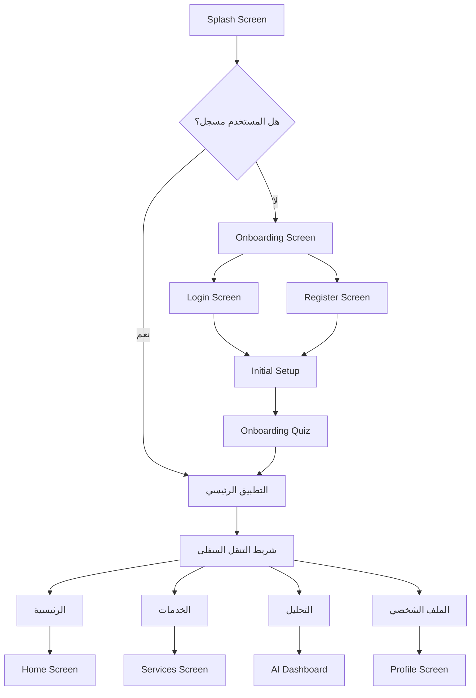
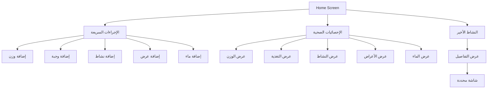
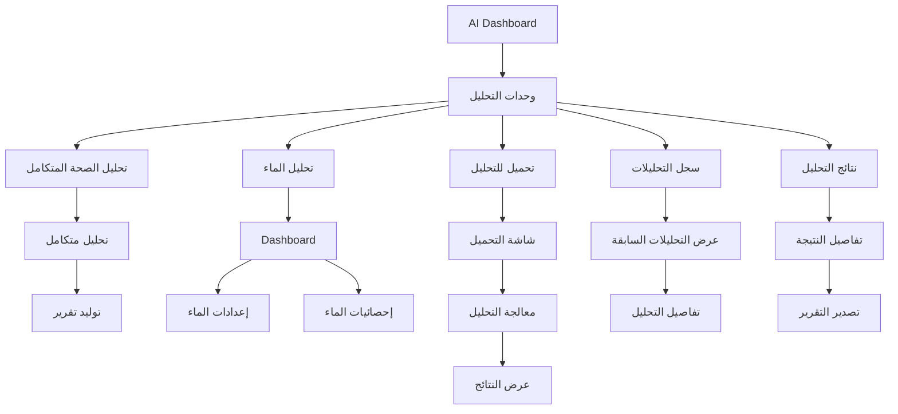
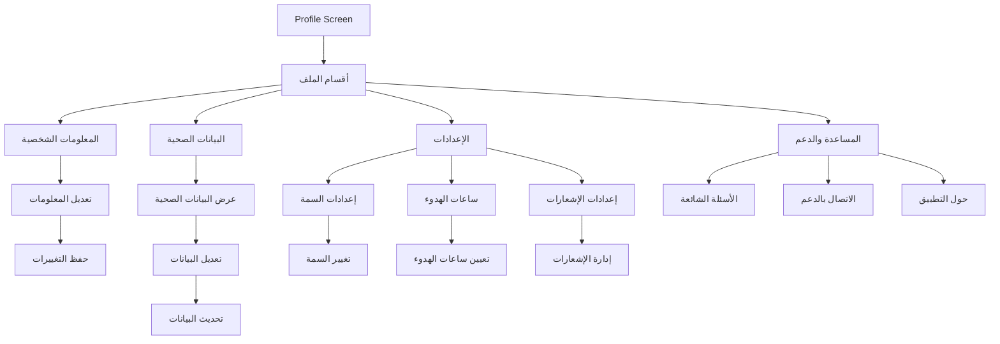
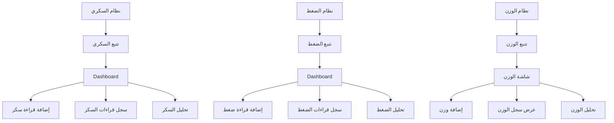
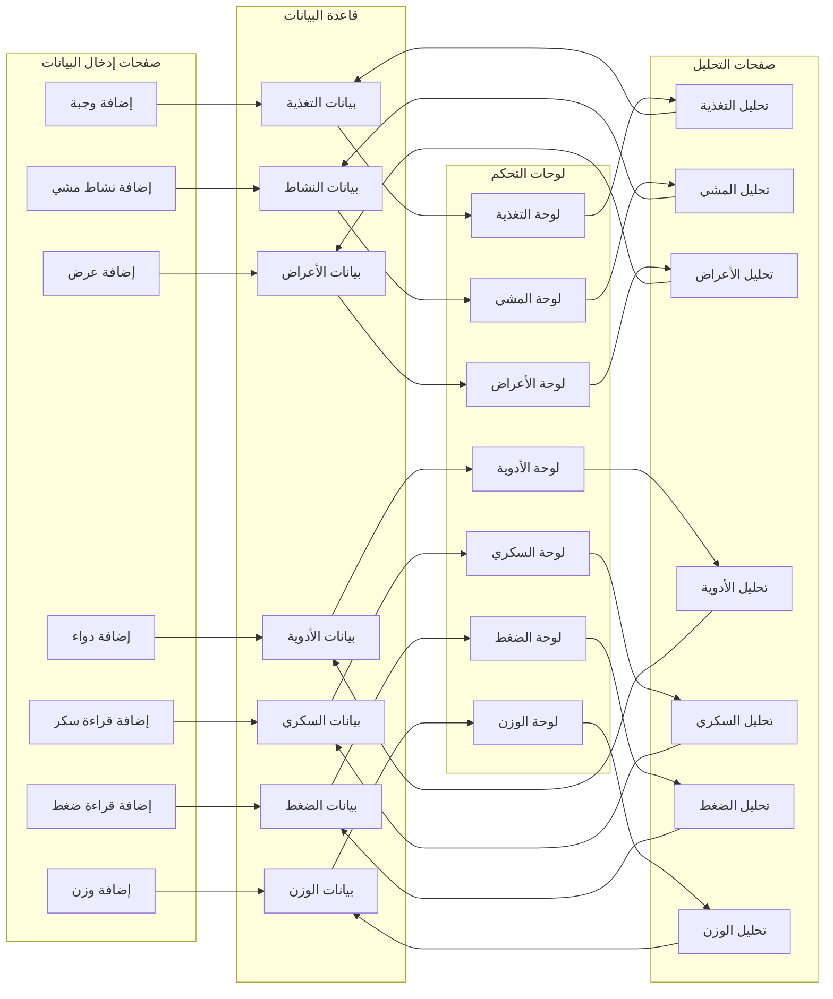
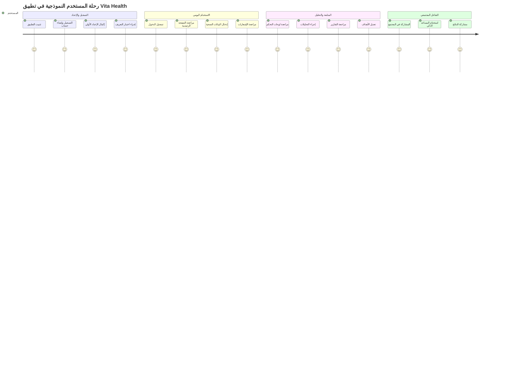
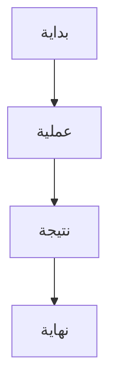

# Flow Chart للصفحات والأنظمة في تطبيق Vita Health

## 📱 مخطط تدفق الصفحات الرئيسية (Navigation Flow)

## 🏠 نظام الصفحات الرئيسية (Home System)

## 🛠️ نظام الخدمات (Services System)

```mermaid
flowchart TD
    ServicesScreen[Services Screen] --> ServicesGrid[شبكة الخدمات]
    
    ServicesGrid --> MedicationsService[الأدوية]
    ServicesGrid --> NutritionService[التغذية]
    ServicesGrid --> WalkingService[المشي]
    ServicesGrid --> SymptomsService[الأعراض]
    ServicesGrid --> QuizService[الاختبارات]
    ServicesGrid --> PredictiveService[التنبؤ الوقائي]
    ServicesGrid --> ChatService[المساعد الذكي]
    ServicesGrid --> CommunityService[المجتمع]
    
    MedicationsService --> MedicationsDashboard[Dashboard]
    MedicationsDashboard --> AddMedication[إضافة دواء]
    MedicationsDashboard --> MedicationDetails[تفاصيل الدواء]
    MedicationsDashboard --> MedicationStats[إحصائيات الأدوية]
    
    NutritionService --> NutritionDashboard[Dashboard]
    NutritionDashboard --> AddMeal[إضافة وجبة]
    NutritionDashboard --> MealHistory[سجل الوجبات]
    NutritionDashboard --> MealSuggestions[اقتراحات وجبات]
    NutritionDashboard --> NutritionAnalysis[تحليل التغذية]
    
    WalkingService --> WalkingDashboard[Dashboard]
    WalkingDashboard --> AddWalking[إضافة نشاط مشي]
    WalkingDashboard --> WalkingStats[إحصائيات المشي]
    WalkingDashboard --> WalkingChallenges[تحديات المشي]
    WalkingDashboard --> WalkingSimulation[محاكاة المشي]
    
    SymptomsService --> SymptomsDashboard[Dashboard]
    SymptomsDashboard --> AddSymptom[إضافة عرض]
    SymptomsDashboard --> SymptomHistory[سجل الأعراض]
    SymptomsDashboard --> SymptomAnalysis[تحليل الأعراض]
    
    QuizService --> DailyQuizDashboard[Dashboard]
    DailyQuizDashboard --> DailyQuiz[اختبار يومي]
    DailyQuizDashboard --> QuizResults[نتائج الاختبار]
    DailyQuizDashboard --> QuizAnalysis[تحليل الاختبار]
    
    PredictiveService --> PredictiveDashboard[Dashboard]
    PredictiveDashboard --> RiskAnalysis[تحليل المخاطر]
    PredictiveDashboard --> PreventionPlans[الخطط الوقائية]
    
    ChatService --> ChatMain[المساعد الذكي]
    ChatMain --> ChatHistory[سجل المحادثات]
    ChatMain --> FAQ[الأسئلة الشائعة]
    
    CommunityService --> CommunityMain[المجتمع]
    CommunityMain --> GroupsScreen[المجموعات]
    CommunityMain --> CreatePost[إنشاء منشور]
    CommunityMain --> SavedPosts[المشاركات المحفوظة]
```

## 🔬 نظام التحليل (Analysis System)

## 👤 نظام الملف الشخصي (Profile System)

## 🩺 نظام الأمراض المزمنة (Chronic Diseases System)

## 🔄 مخطط تدفق البيانات بين الصفحات

## 🎯 مخطط هيكل التطبيق الكلي

```mermaid
flowchart TD
    App[تطبيق Vita Health] --> CoreSystems[الأنظمة الأساسية]
    
    CoreSystems --> AuthSystem[نظام المصادقة]
    CoreSystems --> DataSystem[نظام البيانات]
    CoreSystems --> AnalysisSystem[نظام التحليل]
    CoreSystems --> NotificationSystem[نظام الإشعارات]
    
    AuthSystem --> Login[تسجيل الدخول]
    AuthSystem --> Register[التسجيل]
    AuthSystem --> SessionMgmt[إدارة الجلسات]
    
    DataSystem --> LocalStorage[التخزين المحلي]
    DataSystem --> CloudSync[مزامنة السحابة]
    DataSystem --> APIIntegration[تكامل API]
    
    AnalysisSystem --> PredictiveAnalysis[التحليل التنبؤي]
    AnalysisSystem --> AIAnalysis[التحليل بالذكاء الاصطناعي]
    AnalysisSystem --> StatisticalAnalysis[التحليل الإحصائي]
    
    NotificationSystem --> PushNotifications[الإشعارات الدفعية]
    NotificationSystem --> Reminders[التذكيرات]
    NotificationSystem --> Alerts[التنبيهات]
    
    App --> FeatureModules[وحدات الميزات]
    
    FeatureModules --> HealthTracking[تتبع الصحة]
    FeatureModules --> MedicationMgmt[إدارة الأدوية]
    FeatureModules --> NutritionPlanning[تخطيط التغذية]
    FeatureModules --> ActivityMonitoring[مراقبة النشاط]
    FeatureModules --> SymptomTracking[تتبع الأعراض]
    FeatureModules --> CommunitySupport[دعم المجتمع]
    
    HealthTracking --> VitalSigns[العلامات الحيوية]
    HealthTracking --> ChronicDiseases[الأمراض المزمنة]
    HealthTracking --> HealthMetrics[المقاييس الصحية]
    
    MedicationMgmt --> MedicationSchedule[جدول الأدوية]
    MedicationMgmt --> RefillReminders[تذكير التجديد]
    MedicationMgmt --> InteractionChecks[فحص التفاعلات]
    
    NutritionPlanning --> MealTracking[تتبع الوجبات]
    NutritionPlanning --> CalorieCounting[عد السعرات]
    NutritionPlanning --> NutrientAnalysis[تحليل العناصر]
    
    ActivityMonitoring --> StepCounting[عد الخطوات]
    ActivityMonitoring --> ExerciseTracking[تتبع التمارين]
    ActivityMonitoring --> ActivityGoals[أهداف النشاط]
    
    SymptomTracking --> SymptomLogging[تسجيل الأعراض]
    SymptomTracking --> PatternDetection[كشف الأنماط]
    SymptomTracking --> SeverityAssessment[تقييم الشدة]
    
    CommunitySupport --> Groups[المجموعات]
    CommunitySupport --> Discussions[المناقشات]
    CommunitySupport --> PeerSupport[الدعم من الأقران]
    
    App --> UISystem[نظام واجهة المستخدم]
    
    UISystem --> Navigation[التنقل]
    UISystem --> Themes[السمات]
    UISystem --> Animations[الحركات]
    UISystem --> ResponsiveDesign[التصميم المتجاوب]
```

## 📊 مخطط تدفق المستخدم النموذجي

## 🖼️ كيفية تحويل المخططات إلى صور

لتحويل مخططات Mermaid هذه إلى صور، يمكنك استخدام الأدوات التالية:

### 1. **أدوات عبر الإنترنت:**
- [Mermaid Live Editor](https://mermaid.live/)
- [Mermaid CLI](https://github.com/mermaid-js/mermaid-cli)
- [Mermaid to PNG Converters](https://github.com/mermaid-js/mermaid#generating-diagrams-from-the-command-line)

### 2. **خطوات التحويل:**
1. انسخ كود Mermaid من أي مخطط أعلاه
2. الصقه في محرر Mermaid Live Editor
3. اضغط على زر "Export" أو "Download"
4. اختر تنسيق الصورة (PNG، SVG، PDF)

### 3. **أمثلة على الأكواد:**

## 📁 ملخص هيكل الصفحات

| النظام | الصفحات الرئيسية | الوظيفة |
|--------|------------------|---------|
| **المصادقة** | Splash، Login، Register، Onboarding | إدارة حسابات المستخدمين |
| **الرئيسية** | Home Screen، Quick Actions | نظرة عامة على الصحة |
| **التغذية** | Nutrition Dashboard، Add Meal، Analysis | تتبع وتحليل التغذية |
| **النشاط** | Walking Dashboard، Add Activity، Statistics | تتبع النشاط البدني |
| **الأعراض** | Symptoms Dashboard، Add Symptom، Analysis | تتبع وتحليل الأعراض |
| **الأدوية** | Medications Dashboard، Add Medication، Stats | إدارة الأدوية |
| **السكري** | Sugar Dashboard، Add Reading، Analysis | تتبع وتحليل السكري |
| **الضغط** | Pressure Dashboard، Add Reading، Analysis | تتبع وتحليل الضغط |
| **الاختبارات** | Quiz Dashboard، Daily Quiz، Results | اختبارات صحية يومية |
| **التنبؤ** | Predictive Dashboard، Risk Analysis | تحليل المخاطر الصحية |
| **المساعد الذكي** | Chat Main، History، FAQ | مساعدة ذكية للصحة |
| **المجتمع** | Community Main، Groups، Posts | دعم مجتمعي |
| **التحليل** | AI Dashboard، Health Analysis، Water Analysis | تحليلات متقدمة |
| **الملف الشخصي** | Profile، Settings، Help | إدارة الحساب والإعدادات |

هذه المخططات توضح هيكل التطبيق الكامل وتدفق الصفحات بين الأنظمة المختلفة.