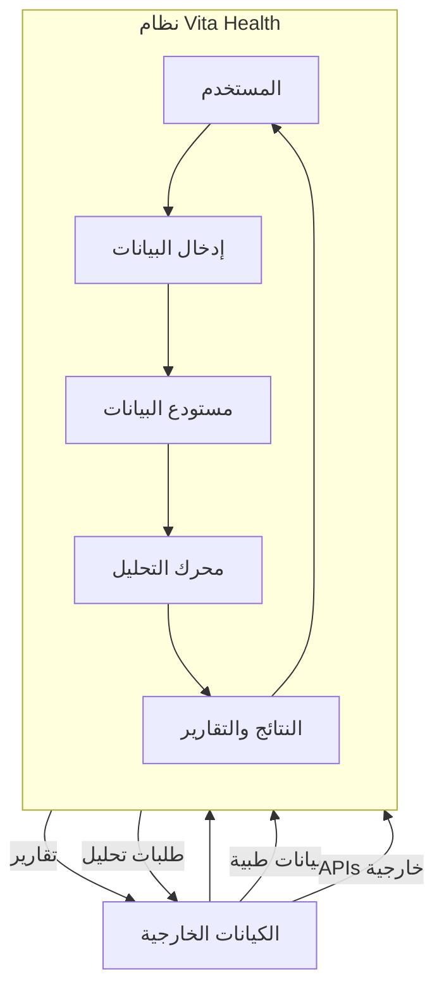
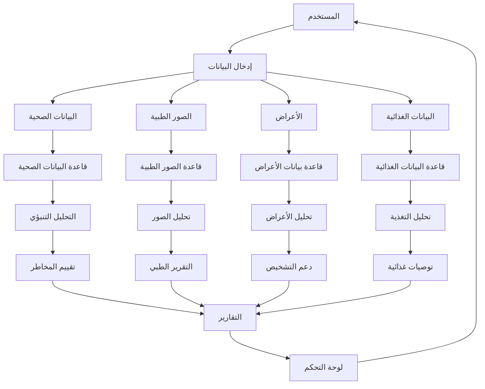
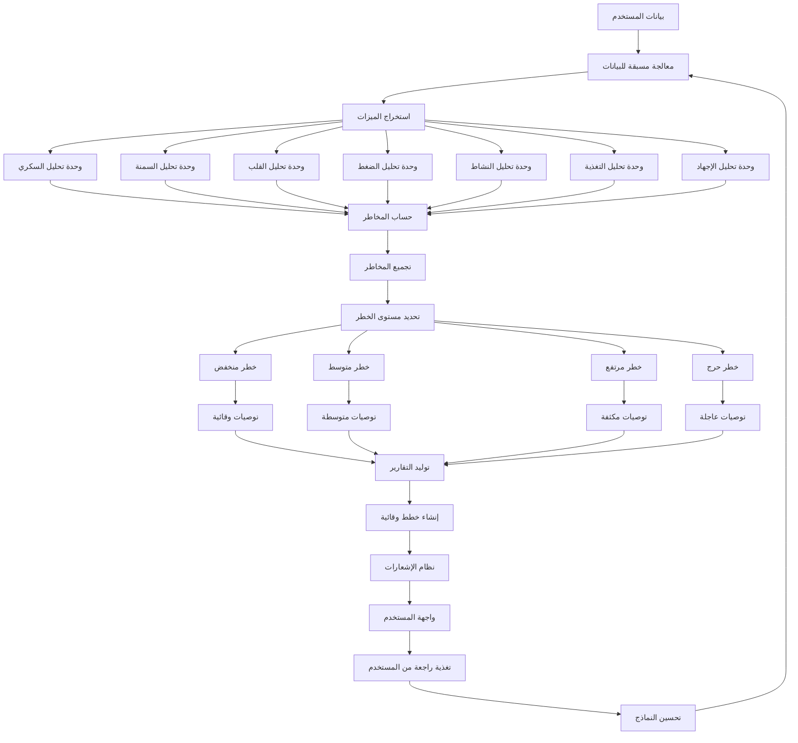

# شرح نظام Data Analysis في مشروع Vita Health

## 📊 نظرة عامة على نظام التحليل

نظام Data Analysis في تطبيق Vita Health هو نظام متكامل لتحليل البيانات الصحية للمستخدمين باستخدام تقنيات متعددة تشمل:
- **التحليل الإحصائي** للبيانات الصحية
- **التحليل التنبؤي** للمخاطر الصحية
- **التحليل بالذكاء الاصطناعي** للأنماط والتوصيات
- **تحليل الصور الطبية** باستخدام OCR وAPIs خارجية

## 🏗️ مكونات نظام التحليل

### 1. **وحدات التحليل الرئيسية**

| الوحدة | الملف | الوصف |
|--------|-------|--------|
| **التحليل التنبؤي** | [`back/routers/predictive_prevention.py`](back/routers/predictive_prevention.py) | تحليل المخاطر الصحية المستقبلية |
| **التحليل بالذكاء الاصطناعي** | [`back/routers/ai_analytics.py`](back/routers/ai_analytics.py) | تحليل الأنماط والتوصيات الذكية |
| **تحليل الصور الطبية** | [`back/routers/analysis.py`](back/routers/analysis.py) | تحليل نتائج التحاليل الطبية من الصور |
| **تحليل الأعراض** | [`back/routers/symptoms.py`](back/routers/symptoms.py) | تحليل الأعراض الصحية |
| **تحليل التغذية** | [`back/routers/nutrition.py`](back/routers/nutrition.py) | تحليل البيانات الغذائية |
| **تحليل السكري** | [`back/routers/diabetes.py`](back/routers/diabetes.py) | تحليل بيانات مرض السكري |
| **تحليل الاختبارات** | [`back/routers/quiz.py`](back/routers/quiz.py) | تحليل نتائج الاختبارات الصحية |

### 2. **خدمات التحليل**

| الخدمة | الملف | الوصف |
|--------|-------|--------|
| **AI Service** | [`back/services/ai_service.py`](back/services/ai_service.py) | خدمات الذكاء الاصطناعي للتحليل |
| **Chat AI Service** | [`back/services/chat_ai_service.py`](back/services/chat_ai_service.py) | تحليل المحادثات والأعراض |

## 🔄 DFD (مخطط تدفق البيانات) - المستوى 0



## 📈 DFD - المستوى 1 (نظام التحليل)



## 🧠 DFD - المستوى 2 (محرك التحليل التنبؤي)



## 🔧 خوارزميات التحليل المستخدمة

### 1. **تحليل السكري**
```python
# في back/routers/predictive_prevention.py
def _analyze_diabetes_risk(user_id, db, user_nutrition):
    # جمع قياسات السكر
    blood_sugar_measurements = db.query(...).filter(...).all()
    
    # حساب المتوسطات
    avg_fasting = sum(fasting_values) / len(fasting_values) if fasting_values else 0
    avg_post_meal = sum(post_meal_values) / len(post_meal_values) if post_meal_values else 0
    
    # تحديد مستوى الخطر
    if avg_fasting > 126 or avg_post_meal > 200:
        risk_level = "high"
        probability = 0.8
    elif avg_fasting > 110 or avg_post_meal > 140:
        risk_level = "medium"
        probability = 0.6
    else:
        risk_level = "low"
        probability = 0.3
    
    # إضافة عوامل إضافية
    if user_nutrition.bmi and user_nutrition.bmi > 30:
        probability += 0.1  # السمنة تزيد الاحتمالية
    
    return HealthRiskPrediction(...)
```

### 2. **تحليل السمنة**
```python
def _analyze_obesity_risk(user_id, db, user_nutrition):
    bmi = user_nutrition.bmi
    
    if bmi >= 30:
        risk_level = "high"
        probability = 0.8
    elif bmi >= 25:
        risk_level = "medium"
        probability = 0.6
    else:
        risk_level = "low"
        probability = 0.2
    
    # تحليل النشاط البدني
    walking_activities = db.query(...).filter(...).all()
    if not walking_activities:
        probability += 0.1  # قلة النشاط تزيد الاحتمالية
    
    return HealthRiskPrediction(...)
```

### 3. **تحليل الصور الطبية**
```python
# في back/routers/analysis.py
def analyze_with_deepseek(image_path):
    """إرسال الصورة لـ DeepSeek API للتحليل"""
    api_key = os.getenv("DEEPSEEK_API_KEY")
    headers = {"Authorization": f"Bearer {api_key}"}
    
    with open(image_path, "rb") as image_file:
        files = {"image": image_file}
        data = {"model": "deepseek-chat"}
        
        response = requests.post(
            "https://api.deepseek.com/v1/chat/completions",
            headers=headers,
            files=files,
            data=data
        )
    
    return response.json()
```

## 📊 تدفق البيانات في نظام التحليل

### **مسار البيانات النموذجي:**

```
1. إدخال البيانات ← المستخدم يدخل بياناته الصحية
2. التخزين ← حفظ البيانات في قواعد البيانات المناسبة
3. المعالجة ← تنظيف البيانات وتحضيرها للتحليل
4. التحليل ← تطبيق الخوارزميات المناسبة
5. التجميع ← جمع نتائج التحليل من وحدات متعددة
6. التقييم ← تحديد مستويات الخطر والتوصيات
7. التقرير ← توليد تقارير مخصصة
8. العرض ← عرض النتائج في واجهة المستخدم
9. التغذية الراجعة ← تحديث النماذج بناءً على النتائج
```

### **مستودعات البيانات (Data Stores):**

| المستودع | نوع البيانات | أمثلة |
|----------|--------------|-------|
| **البيانات الصحية** | القياسات الحيوية | الوزن، الطول، BMI، العمر |
| **البيانات الطبية** | نتائج التحاليل | CBC، سكر الدم، ضغط الدم |
| **البيانات الغذائية** | السجلات الغذائية | الوجبات، السعرات، العناصر الغذائية |
| **بيانات النشاط** | النشاط البدني | الخطوات، المسافة، السعرات المحروقة |
| **بيانات الأعراض** | الأعراض الصحية | الصداع، الدوخة، الألم |
| **بيانات الأدوية** | الأدوية والجرعات | الأسماء، الجرعات، المواعيد |

## 🎯 أنواع التحليل المتاحة

### 1. **التحليل الإحصائي البسيط**
- حساب المتوسطات والانحرافات المعيارية
- تحليل الاتجاهات الزمنية
- مقارنة القيم مع المعايير الصحية

### 2. **التحليل التنبؤي**
- توقع المخاطر الصحية المستقبلية
- تحديد احتمالات الإصابة بالأمراض
- تحليل عوامل الخطر

### 3. **التحليل التشخيصي**
- تحليل الأعراض وتحديد الأسباب المحتملة
- دعم قرارات التشخيص
- تحديد الحالات الطارئة

### 4. **التحليل التوصيلي**
- توليد توصيات مخصصة
- إنشاء خطط وقائية
- اقتراح تغييرات في نمط الحياة

## 🔗 تكامل النظام مع المكونات الأخرى

### **التكامل مع Frontend:**
```dart
// في lib/services/predictive_prevention_api.dart
static Future<Map<String, dynamic>> getPreventionDashboard() async {
  final userId = await PrefsHelper.getUserId();
  final uri = Uri.parse('$_baseUrl/dashboard?user_id=$userId');
  final response = await http.get(uri, headers: headers);
  return jsonDecode(response.body);
}
```

### **التكامل مع قاعدة البيانات:**
```python
# في back/routers/predictive_prevention.py
@router.post("/analyze", response_model=List[HealthRiskPrediction])
def analyze_health_risks(user_id: int, db: Session = Depends(get_db)):
    # جلب بيانات المستخدم من قاعدة البيانات
    user_nutrition = db.query(models.UserNutrition).filter(...).first()
    
    # إجراء التحليل
    predictions = []
    
    # تحليل الأمراض المزمنة
    diseases = user_nutrition.diseases or []
    if "diabetes" in diseases:
        diabetes_risk = _analyze_diabetes_risk(user_id, db, user_nutrition)
        if diabetes_risk:
            predictions.append(diabetes_risk)
    
    return predictions
```

## 📋 أمثلة على مخرجات النظام

### **مثال 1: تقرير تحليل السكري**
```json
{
  "risk_type": "diabetes",
  "risk_level": "high",
  "probability": 0.85,
  "confidence": 0.7,
  "factors": ["مستويات سكر مرتفعة باستمرار", "سمنة", "عمر فوق 45 سنة"],
  "timeframe": "medium_term",
  "description": "خطر الإصابة بمضاعفات السكري أو تفاقم الحالة",
  "recommendations": [
    "مراقبة مستوى السكر بانتظام",
    "اتباع نظام غذائي صحي",
    "ممارسة الرياضة بانتظام",
    "التحكم في الوزن",
    "استشارة طبيب متخصص"
  ]
}
```

### **مثال 2: خطة وقائية**
```json
{
  "plan_name": "خطة الوقاية من السكري",
  "description": "خطة مخصصة للتحكم في مستويات السكر",
  "priority": "high",
  "progress_percentage": 25.0,
  "actions": [
    {"action": "قياس السكر يومياً", "completed": true},
    {"action": "ممارسة رياضة 30 دقيقة", "completed": false},
    {"action": "تقليل السكريات", "completed": true},
    {"action": "زيادة الخضروات", "completed": false}
  ]
}
```

## 🚀 توصيات للتحسين والتطوير

### 1. **تحسين الخوارزميات**
- إضافة تعلم الآلة للتنبؤ الأكثر دقة
- استخدام نماذج أكثر تعقيداً للتحليل
- تحسين معايير التقييم

### 2. **توسيع نطاق التحليل**
- إضافة تحليل لمزيد من الأمراض
- دعم المزيد من أنواع الصور الطبية
- تحليل البيانات الجينية

### 3. **تحسين الأداء**
- إضافة caching للنتائج المتكررة
- تحسين استعلامات قاعدة البيانات
- معالجة متوازية للتحليلات الكبيرة

### 4. **تعزيز الأمان**
- تشفير البيانات الصحية الحساسة
- التحقق من صلاحية البيانات المدخلة
- تسجيل عمليات التحليل للتدقيق

## 📝 ملخص

نظام Data Analysis في Vita Health هو نظام متكامل يستخدم:
- **التحليل الإحصائي** لفهم البيانات الحالية
- **التحليل التنبؤي** لتوقع المخاطر المستقبلية
- **التحليل بالذكاء الاصطناعي** للأنماط والتوصيات
- **تحليل الصور** للنتائج الطبية

يعمل النظام على تحويل البيانات الصحية الخام إلى رؤى قابلة للتنفيذ، مما يساعد المستخدمين على تحسين صحتهم ومنع الأمراض قبل حدوثها.