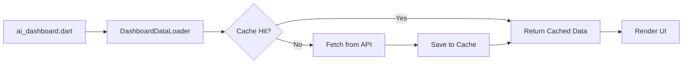

# خطة تطوير نظام التحليل (Data Analysis System)

## نظرة عامة على النظام الحالي

```
┌─────────────────────────────────────────────────────────────────┐
│                    Frontend (Flutter)                           │
│  ┌─────────────────────────────────────────────────────────┐   │
│  │  ai_dashboard.dart (2129 lines) - لوحة التحكم الرئيسية  │   │
│  │  └─ يحمل بيانات من 8+ خدمات في وقت واحد                 │   │
│  │  └─ يحتوي على كل المنطق + الواجهة + الأنيميشن           │   │
│  ├─────────────────────────────────────────────────────────┤   │
│  │  analysis_upload_screen.dart (633 lines) - رفع الملفات   │   │
│  │  analysis_result_screen.dart (739 lines) - عرض النتائج   │   │
│  │  analysis_history_screen.dart (254 lines) - سجل التحليل  │   │
│  │  water_dashboard.dart (617 lines) - لوحة المياه          │   │
│  │  integrated_health_analysis.dart (722 lines) - معطل ❌   │   │
│  ├─────────────────────────────────────────────────────────┤   │
│  │  advanced_symptom_analysis.dart (853 lines) - تحليل      │   │
│  │  الأعراض مع قاعدة بيانات طعام مدمجة (Client-side)       │   │
│  └─────────────────────────────────────────────────────────┘   │
│                                                                │
│                    Backend (FastAPI/Python)                     │
│  ┌─────────────────────────────────────────────────────────┐   │
│  │  analysis.py (581 lines) - OCR + DeepSeek API           │   │
│  │  ai_analytics.py (190 lines) - توصيات المياه + النقاط   │   │
│  │  ai_service.py (444 lines) - تحليل شامل + توقعات        │   │
│  │  weight_predictor.py (294 lines) - ML (sklearn)         │   │
│  └─────────────────────────────────────────────────────────┘   │
└─────────────────────────────────────────────────────────────────┘
```

---

## المشاكل الرئيسية

### 🔴 مشاكل حرجة
| # | المشكلة | الملف | التأثير |
|---|---------|-------|---------|
| 1 | **لوحة تحكم ضخمة (2129 سطر)** | `ai_dashboard.dart` | صعبة الصيانة والتطوير |
| 2 | **كود ميت (722 سطر)** | `integrated_health_analysis.dart` | كود مهمل يسبب ارتباك |
| 3 | **مفتاح API مكشوف** | `analysis.py` | خطر أمني - DeepSeek API key |
| 4 | **قاعدة بيانات طعام مدمجة** | `advanced_symptom_analysis.dart` | تضخم الكود وصعوبة التحديث |

### 🟡 مشاكل متوسطة
| # | المشكلة | الملف | التأثير |
|---|---------|-------|---------|
| 5 | **14+ طلب API عند فتح الصفحة** | `ai_dashboard.dart` | بطء شديد في التحميل |
| 6 | **لا يوجد تخزين مؤقت (Caching)** | جميع الملفات | تكرار الطلبات |
| 7 | **لا يوجد WebSocket للتحليل المباشر** | - | تجربة مستخدم بطيئة |
| 8 | **نماذج ML بسيطة فقط** | `weight_predictor.py` | دقة توقعات محدودة |

### 🟢 مشاكل تحسينية
| # | المشكلة | الملف | التأثير |
|---|---------|-------|---------|
| 9 | **لا يوجد تحليل مقارن** | - | لا مقارنة مع المجتمع |
| 10 | **لا يوجد تصدير بيانات** | - | لا CSV/PDF |
| 11 | **لا يوجد رؤى تلقائية** | - | المستخدم يبحث بنفسه |
| 12 | **لا يوجد رسوم بيانية للارتباط** | - | لا تحليل علاقات |

---

## خطة التطوير - 4 مراحل

### المرحلة 1: إعادة هيكلة فورية (Refactoring)

#### 1.1 تفكيك ai_dashboard.dart
**الهدف:** تقسيم 2129 سطر إلى مكونات قابلة للإدارة

```
ai_dashboard/
├── ai_dashboard.dart              # الهيكل الرئيسي (100-150 سطر)
├── widgets/
│   ├── health_score_card.dart     # بطاقة النقاط الصحية
│   ├── water_status_card.dart     # بطاقة حالة المياه
│   ├── nutrition_card.dart        # بطاقة التغذية
│   ├── symptoms_card.dart         # بطاقة الأعراض
│   ├── medications_card.dart      # بطاقة الأدوية
│   ├── quiz_card.dart             # بطاقة الكويز
│   ├── diabetes_card.dart         # بطاقة السكري
│   └── community_card.dart        # بطاقة المجتمع
├── services/
│   └── dashboard_data_loader.dart # تحميل البيانات بشكل منظم
└── models/
    └── dashboard_state.dart       # حالة اللوحة
```

**خطوات التنفيذ:**
1. إنشاء `DashboardDataLoader` service لإدارة تحميل البيانات
2. إنشاء `DashboardState` model لحفظ الحالة
3. استخراج كل بطاقة إلى Widget منفصل
4. إضافة `ErrorBoundary` لكل بطاقة (إذا فشلت API واحدة، الباقي يعمل)

#### 1.2 معالجة integrated_health_analysis.dart
**الخيارات:**
- **الخيار أ (مُفضّل):** إحياء الملف - إنشاء `IntegratedHealthData` model وربطه بالـ API
- **الخيار ب:** حذف الملف نهائياً

#### 1.3 نقل قاعدة بيانات الطعام إلى Backend
**الهدف:** نقل `advanced_symptom_analysis.dart` food database إلى Backend

**التغييرات:**
- إنشاء `back/data/food_database.json` - قاعدة بيانات طعام منظمة
- إنشاء endpoint: `GET /api/food-recommendations?symptom={symptom}`
- تبسيط `advanced_symptom_analysis.dart` ليصبح مجرد Client يستدعي API

---

### المرحلة 2: تحسين الأداء والتجربة

#### 2.1 إضافة Caching Layer


**التنفيذ:**
- استخدام `shared_preferences` أو `hive` للتخزين المؤقت
- مدة الصلاحية: 5 دقائق للبيانات العادية، 30 دقيقة للإحصائيات
- تحديث في الخلفية (Background refresh)

#### 2.2 إضافة WebSocket للتحليل المباشر
**الهدف:** تجربة مستخدم أفضل عند تحليل الملفات

**التغييرات:**
- Backend: إضافة WebSocket endpoint `ws://server/ws/analysis/{task_id}`
- Frontend: إضافة `web_socket_channel` package
- عرض تقدم التحليل خطوة بخطوة (OCR → DeepSeek → استخراج → نتائج)

#### 2.3 تحسين ML Models
**الهدف:** زيادة دقة التوقعات

**الإضافات المقترحة:**
- **LSTM/GRU** للتنبؤ بالوزن (سلاسل زمنية)
- **Random Forest** محسّن لتحليل الأعراض
- **XGBoost** لتحليل فعالية الأدوية
- **Clustering (K-Means)** لتجميع أنماط المستخدمين

```python
# مثال: إضافة LSTM للتنبؤ بالوزن
from tensorflow.keras.models import Sequential
from tensorflow.keras.layers import LSTM, Dense, Dropout

class AdvancedWeightPredictor:
    def __init__(self):
        self.model = Sequential([
            LSTM(50, return_sequences=True, input_shape=(30, 5)),
            Dropout(0.2),
            LSTM(50, return_sequences=False),
            Dropout(0.2),
            Dense(25),
            Dense(1)
        ])
        self.model.compile(optimizer='adam', loss='mse')
```

---

### المرحلة 3: ميزات تحليلية متقدمة

#### 3.1 التحليل المقارن (Comparative Analytics)
**الهدف:** مقارنة المستخدم مع المجتمع

**الميزات:**
- مقارنة الوزن مع المستخدمين المماثلين (نفس العمر/الجنس)
- مقارنة جودة النوم والنشاط
- "أنت في أعلى 25% من المستخدمين في..."
- Percentile rankings

**API Endpoints جديدة:**
```
GET /api/analytics/compare-weight/{user_id}
GET /api/analytics/community-percentiles/{user_id}
GET /api/analytics/similar-users/{user_id}
```

#### 3.2 الرؤى التلقائية (Auto Insights)
**الهدف:** إنشاء رؤى صحية تلقائياً بناءً على البيانات

**أمثلة:**
- "لاحظنا أن وزنك يزيد في أيام الجمعة - هل هناك علاقة بنظام الأكل؟"
- "معدل نشاطك انخفض 30% هذا الأسبوع مقارنة بالأسبوع الماضي"
- "أعراض الصداع تظهر عادة بعد 3 أيام من قلة النوم"

**التنفيذ:**
- Backend: `InsightEngine` class يحلل الأنماط ويكتشف العلاقات
- Frontend: `AutoInsightsCard` widget يعرض الرؤى

#### 3.3 مصفوفة الارتباط (Correlation Heatmap)
**الهدف:** عرض العلاقات بين المؤشرات الصحية المختلفة

**المؤشرات المقترحة:**
- النوم ↔ الأعراض
- التغذية ↔ الوزن
- شرب الماء ↔ الصداع
- النشاط ↔ جودة النوم
- الأدوية ↔ الأعراض

```dart
// مثال: CorrelationHeatmap widget
class CorrelationHeatmap extends StatelessWidget {
  final Map<String, Map<String, double>> correlations;
  // { 'sleep': {'headache': -0.7, 'energy': 0.8}, ... }
}
```

#### 3.4 تصدير البيانات (Data Export)
**الهدف:** تصدير التحاليل والتقارير

**صيغ التصدير:**
- **PDF:** تقرير صحي شامل
- **CSV:** بيانات خام للتحليل الخارجي
- **JSON:** للتصدير إلى تطبيقات أخرى

**API Endpoints:**
```
GET /api/export/health-report/{user_id}?format=pdf
GET /api/export/analysis-data/{user_id}?format=csv
GET /api/export/full-backup/{user_id}?format=json
```

---

### المرحلة 4: البنية التحتية والأمان

#### 4.1 إخفاء المفاتيح السرية
**الهدف:** نقل جميع المفاتيح إلى Environment Variables

**التغييرات:**
```python
# قبل - analysis.py
DEEPSEEK_API_KEY = "sk-532c55cdfc6647178cb139d67ace583e"  # ❌

# بعد
import os
DEEPSEEK_API_KEY = os.getenv("DEEPSEEK_API_KEY")  # ✅
```

#### 4.2 إضافة Rate Limiting
**الهدف:** حماية الـ API من الإساءة

**التنفيذ:**
- استخدام `slowapi` في FastAPI
- تحديد: 100 طلب/دقيقة للمستخدم الواحد
- تحديد: 10 تحاليل/ساعة للمستخدم الواحد

#### 4.3 تحسين معالجة الأخطاء
**الهدف:** تجربة مستخدم سلسة حتى عند فشل بعض الخدمات

**التنفيذ:**
- `ErrorBoundary` widget لكل بطاقة في الـ Dashboard
- `RetryWidget` مع زر إعادة المحاولة
- `FallbackData` - بيانات افتراضية عند فشل التحميل

---

## الجدول الزمني المقترح

| المرحلة | المهام | الأولوية |
|---------|--------|----------|
| **1** | تفكيك ai_dashboard + معالجة الكود الميت + نقل قاعدة الطعام | 🔴 عاجل |
| **2** | Caching + WebSocket + تحسين ML | 🟡 مهم |
| **3** | تحليل مقارن + رؤى تلقائية + ارتباط + تصدير | 🟢 تحسيني |
| **4** | أمان + Rate Limiting + معالجة أخطاء | 🔴 عاجل |

---

## ملخص التغييرات المقترحة

```
قبل التطوير:
├── 6 شاشات تحليل (إحداها معطل)
├── 3 خدمات تحليل (واحدة ضخمة 853 سطر)
├── 4 ملفات Backend
├── 14+ طلب API عند فتح Dashboard
└── لا Caching - لا WebSocket - لا تحليل مقارن

بعد التطوير:
├── 8+ شاشات تحليل (كلها نشطة)
├── 5+ خدمات تحليل (مقسمة ومنظمة)
├── 6+ ملفات Backend (مع ML متقدم)
├── 3-5 طلبات API فقط (بفضل Caching)
├── WebSocket للتحليل المباشر
├── تحليل مقارن مع المجتمع
├── رؤى تلقائية ذكية
├── تصدير PDF/CSV/JSON
└── معالجة أخطاء متقدمة
```

---

## الأسئلة المفتوحة

1. هل تريد إحياء `integrated_health_analysis.dart` أم حذفه؟
2. هل تفضل استخدام Hive للتخزين المؤقت أم SharedPreferences؟
3. هل تريد إضافة TensorFlow Lite على الجهاز (On-device ML) أم الاعتماد على Backend فقط؟
4. هل هناك ميزة تحليلية محددة تهمك أكثر من غيرها؟