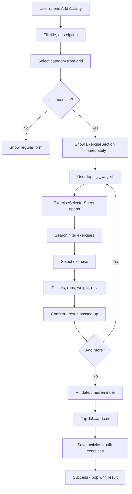

# 🏋️ Gym/Exercise Code Redesign Plan

## Problems Identified in Current Code

### 🔴 Critical Bugs

| # | File | Line | Bug | Impact |
|---|------|------|-----|--------|
| 1 | [`activity_model.dart`](lib/models/activity_model.dart:94) | 94-96 | **Stack overflow**: `int get index { return this.index; }` calls itself recursively | Any use of `ActivityCategoryType.exercise.index` crashes the app |
| 2 | [`add_activity_screen.dart`](lib/screens/activities/add_activity_screen.dart:591) | 591 | **setState during build**: `GestureDetector.onTap` calls `setState` synchronously then shows dialog | Flutter runtime error: "setState() called during build" |
| 3 | [`add_activity_screen.dart`](lib/screens/activities/add_activity_screen.dart:505) | 505 | **setState before dialog**: `TextButton.icon.onPressed` calls `setState` then `_askExerciseTiming()` | Flutter runtime error: "setState() called during build" |
| 4 | [`add_activity_screen.dart`](lib/screens/activities/add_activity_screen.dart:162) | 162 | **Dual dialog flow**: `_askExerciseTiming()` + `showExerciseSelector()` open 2 sequential dialogs | Widget lifecycle conflicts + confusing UX |
| 5 | [`edit_activity_screen.dart`](lib/screens/activities/edit_activity_screen.dart) | all | **Duplicate code**: ~90% identical to `add_activity_screen.dart` | Bug fixes must be applied to both files |

### 🟡 Architectural Problems

| # | Problem | Detail |
|---|---------|--------|
| 6 | **Fragmented state management** | Raw `setState` scattered in parent (add_activity) + child (exercise_form_section) + grandchild (exercise_selector), with `onChanged` callback chain |
| 7 | **Confusing user flow** | Select category → dialog (add now/later) → show section → click add → bottom sheet → select exercise → fill fields → confirm |
| 8 | **`ScaffoldMessenger` inconsistency** | Mixes `_scaffoldMessengerKey.currentState` and `ScaffoldMessenger.of(context)` |
| 9 | **Missing `mounted` checks** | Some `setState` calls lack `mounted` guard |
| 10 | **Over-long files** | `exercise_selector.dart`: 700 lines, `add_activity_screen.dart`: 1026 lines |

---

## Proposed Architecture Redesign

### High-Level Component Structure

```
┌────────────────────────────────────────────────────────────────┐
│                   🧩 Architecture Overview                      │
├────────────────────────────────────────────────────────────────┤
│                                                                │
│  ┌──────────────────────────────────────────────┐              │
│  │        ActivityFormScreen (Merged Add/Edit)   │              │
│  │  ┌─────────────────────────────────────────┐  │              │
│  │  │         CategorySelectorWidget           │  │              │
│  │  └─────────────────────────────────────────┘  │              │
│  │  ┌─────────────────────────────────────────┐  │              │
│  │  │         ExerciseSection (refactored)     │  │              │
│  │  │  ┌──────────────────────────────────┐   │  │              │
│  │  │  │  ExerciseCard (pure presentation) │   │  │              │
│  │  │  └──────────────────────────────────┘   │  │              │
│  │  │  ┌──────────────────────────────────┐   │  │              │
│  │  │  │  AddExerciseButton → shows        │   │  │              │
│  │  │  │  ExerciseSelectorSheet directly   │   │  │              │
│  │  │  └──────────────────────────────────┘   │  │              │
│  │  └─────────────────────────────────────────┘  │              │
│  │  ┌─────────────────────────────────────────┐  │              │
│  │  │     DateTimeSection / ReminderSection    │  │              │
│  │  └─────────────────────────────────────────┘  │              │
│  └──────────────────────────────────────────────┘              │
│                                                                │
│  ActivityFormMixin (shared logic for Add + Edit)               │
└────────────────────────────────────────────────────────────────┘
```

### Data Flow (Simplified)

```
User taps "رياضة" category
    │
    ▼
Step 1: setState + show ExerciseSection immediately
        (NO intermediate dialog - eliminates _askExerciseTiming)
    │
    ▼
Step 2: User taps "اختر تمرين"
    │
    ▼
Step 3: showModalBottomSheet → ExerciseSelectorSheet
        (single dialog, no nesting)
    │
    ▼
Step 4: User selects exercise, fills sets/reps/weight/rest, confirms
    │
    ▼
Step 5: ExerciseFormResult added to parent list via callback
    │
    ▼
Step 6: User can add more exercises (repeat 2-5) or save activity
```

### Before vs After: setState Pattern Fix

**Before (broken):**
```dart
// INLINE onTap in build() method
GestureDetector(
  onTap: () {
    setState(() => _showExerciseSection = false);  // ❌ setState during build
    _askExerciseTiming();                           // ❌ dialog during build
  },
)
```

**After (fixed):**
```dart
// METHOD on the State class
void _onCategorySelected(ActivityCategory category) {
  setState(() {
    _selectedCategory = category;
    _exerciseResults = [];
    _calculatedCalories = null;
  });
  // Exercise section always visible for exercise category (no intermediate dialog)
}

// IN build():
GestureDetector(
  onTap: () => _onCategorySelected(category),
)
```

---

## Step-by-Step Implementation Plan

### Step 1: Fix Stack Overflow Bug
- **File**: [`lib/models/activity_model.dart`](lib/models/activity_model.dart:94)
- **Change**: Replace `return this.index;` with `return super.index;` or `return (this as Enum).index;`

```dart
// BEFORE (line 94-96):
int get index {
  return this.index;  // infinite recursion!
}

// AFTER:
int get index {
  return super.index;  // calls Enum.index correctly
}
```

### Step 2: Eliminate `_askExerciseTiming` Dialog
- **Files**: [`add_activity_screen.dart`](lib/screens/activities/add_activity_screen.dart:162), [`edit_activity_screen.dart`](lib/screens/activities/edit_activity_screen.dart)
- **Change**: Remove `_askExerciseTiming()` and `_showExerciseSection` boolean entirely
- **New behavior**: When user selects exercise category, the `ExerciseFormSection` shows immediately (always visible for exercise category)
- **Why**: Eliminates the dual-dialog flow. User goes directly to adding exercises without an intermediate "now or later" question

### Step 3: Extract Shared ActivityFormMixin
- **New file**: [`lib/mixins/activity_form_mixin.dart`](lib/mixins/activity_form_mixin.dart)
- **Extract common logic** from both Add/Edit screens:
  - State variables: `_exerciseResults`, `_selectedCategory`, `_calculatedCalories`, `_userWeight`, etc.
  - Methods: `_loadUserWeight()`, `_loadPlans()`, `_calculateExerciseCalories()`, `_combineDateAndTime()`, `_calculateTotalCalories()`
  - Dialog helpers: `_showSnackBar()`, `_showDatePicker()`, `_showTimePicker()`
  - Save logic: `_saveActivity()` with activity/exercise persistence
- **Target**: Both `add_activity_screen.dart` and `edit_activity_screen.dart` use this mixin, reducing duplication by ~60%

### Step 4: Refactor Category Selection to Use addPostFrameCallback
- **File**: `add_activity_screen.dart` line 590-601
- **Change**: Extract `_onCategorySelected()` method that safely calls `setState` + any post-frame work
- **Pattern**:
```dart
void _onCategorySelected(ActivityCategory category) {
  setState(() {
    _selectedCategory = category;
    _exerciseResults = [];
    _calculatedCalories = null;
  });
  // No dialog to show - ExerciseSection is always visible for exercise category
}
```

### Step 5: Clean Up ScaffoldMessenger Usage
- **Files**: Both activity screens
- **Change**: Use `_scaffoldMessengerKey.currentState?.showSnackBar()` everywhere instead of `ScaffoldMessenger.of()`
- **Why**: Avoids `referenceBox.attached` error when showing SnackBars after navigation

### Step 6: Add `mounted` Guards to All `setState` Calls
- **Files**: `add_activity_screen.dart`, `edit_activity_screen.dart`
- **Change**: Wrap every `setState` call with `if (mounted)` check
- **Focus areas**: `_saveActivity()` result handlers, `_loadUserWeight()`, `_loadPlans()`, all dialog callbacks

### Step 7: Refactor ExerciseFormSection (Optional Enhancement)
- **File**: [`lib/screens/activities/widgets/exercise_form_section.dart`](lib/screens/activities/widgets/exercise_form_section.dart)
- **Change**: Rename to `ExerciseSection` and simplify:
  - Remove `_askExerciseTiming`-related logic (handled at parent level)
  - Keep `_addExercise()`, `_editExercise()`, `_removeExercise()` as-is (they're well-structured)
  - Add `isExercisesAlwaysVisible` flag (true for new activities, false for edit mode with no exercises)
  - Extract `_ExerciseCard` into a separate file if used elsewhere

### Step 8: Break Down ExerciseSelector (Optional)
- **File**: [`lib/screens/activities/widgets/exercise_selector.dart`](lib/screens/activities/widgets/exercise_selector.dart) (700 lines)
- **Extract** into:
  - `exercise_selector_sheet.dart` - the `showExerciseSelector()` function
  - `exercise_selector_widget.dart` - the `ExerciseSelectorWidget` StatefulWidget
  - `exercise_selector_models.dart` - `ExerciseSelectionResult` class

### Step 9: Fix add_symptom_screen.dart Deactivated Widget Error (Bonus)
- **File**: [`lib/screens/symptoms/add_symptom_screen.dart`](lib/screens/symptoms/add_symptom_screen.dart)
- **Change**: Swap order - `Navigator.pop` first, then show SnackBar using a global key

### Step 10: Fix Symptom "إرهاق" Not Matching (Bonus)
- **File**: [`back/routers/symptoms.py`](back/routers/symptoms.py)
- **Change**: Add partial/fuzzy matching so "إرهاق" matches "تعب وإرهاق", or add "إرهاق" as a separate key in `analysis_map`

---

## File Change Summary

| File | Action | Change Type |
|------|--------|-------------|
| `lib/models/activity_model.dart` | Edit | 🔴 Bug fix (stack overflow) |
| `lib/screens/activities/add_activity_screen.dart` | Refactor | 🟡 Major (remove dialog, add mixin) |
| `lib/screens/activities/edit_activity_screen.dart` | Refactor | 🟡 Major (add mixin) |
| `lib/mixins/activity_form_mixin.dart` | **New file** | 🟢 Create mixin |
| `lib/screens/activities/widgets/exercise_form_section.dart` | Minor refactor | 🟢 Simplify |
| `lib/screens/activities/widgets/exercise_selector.dart` | Optional extract | 🟢 Break down |
| `lib/screens/symptoms/add_symptom_screen.dart` | Edit | 🟢 Bonus fix |
| `back/routers/symptoms.py` | Edit | 🟢 Bonus fix |

---

## Mermaid Flow Diagram: New User Flow



---

## Risk Assessment

| Risk | Likelihood | Mitigation |
|------|-----------|------------|
| Compilation errors from mixin refactor | Medium | Test compile after each step |
| Regression in edit mode | Medium | Keep `initialExercises` param, test edit loads existing exercises |
| `referenceBox.attached` still occurs | Low | Remove all `ScaffoldMessenger.of()` in favor of key |
| New setState-during-build patterns introduced | Low | Use extracted methods, never inline `setState` in widget callbacks |