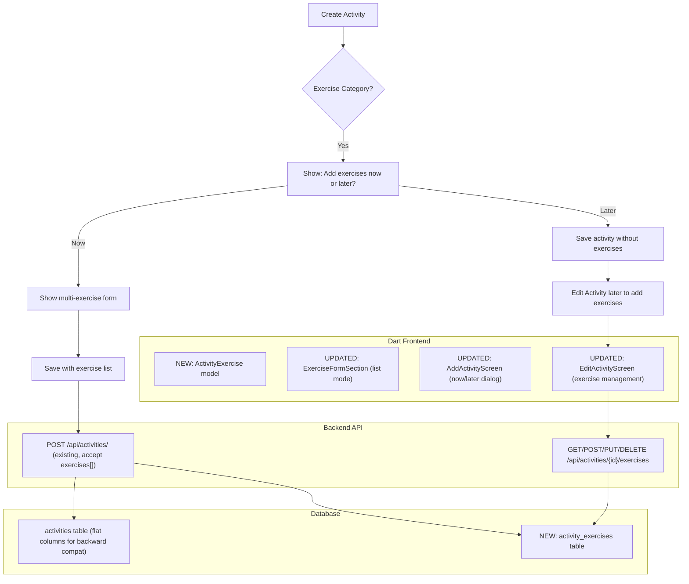
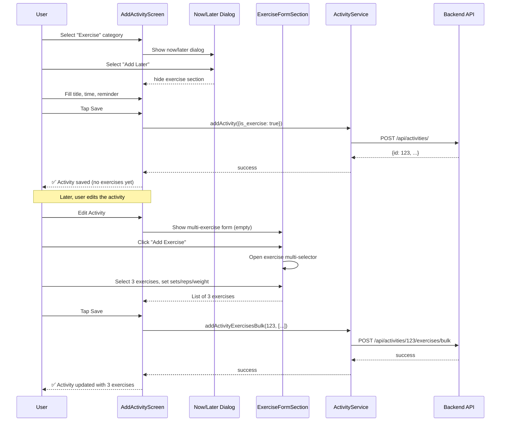
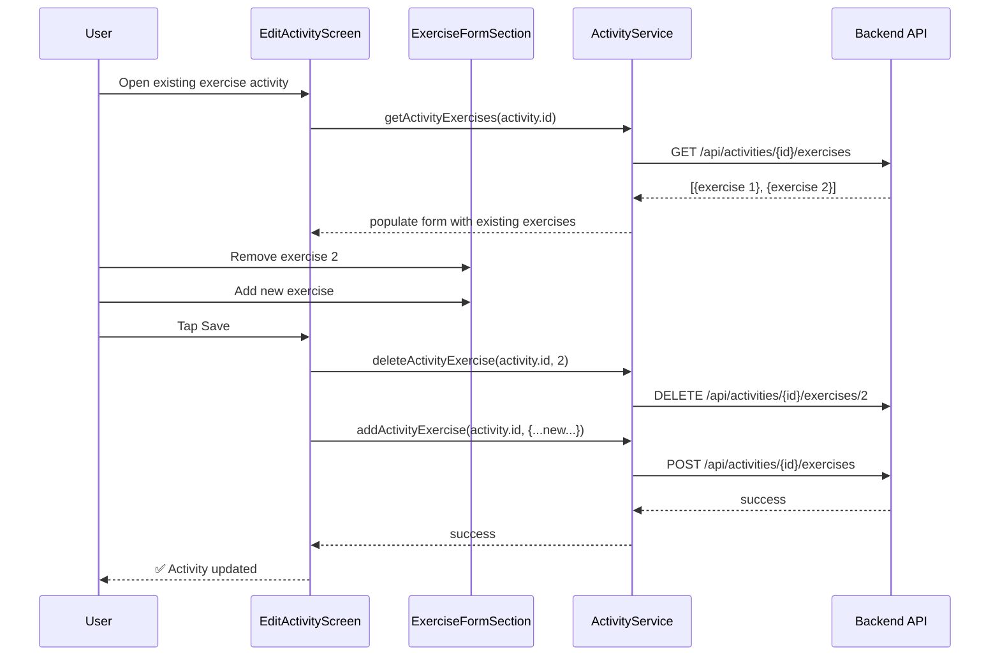

# Multi-Exercise Activity & "Now or Later" Implementation Plan

## Problem Summary

The user identified two issues with the current activity exercise feature:

1. **Single exercise only**: The database schema, backend models, Dart models, and UI all support **only one exercise** per activity. Users who go to the gym perform multiple exercises, not just one.

2. **Exercises required at creation time**: When creating an activity with "Exercise" category, the user **must** select an exercise immediately. But activities are alarm-like reminders — users know their schedule but not their exact workout plan. They want a **"Do you want to add exercises now or later?"** dialog.

---

## Architecture Overview



---

## Step-by-Step Tasks

### Phase 1 — Backend Database & Models

#### Task 1.1: Create SQL migration for `activity_exercises` table

**File**: `back/add_activity_exercises_table.sql` (NEW)

Create a new table with these columns:
- `id` INT AUTO_INCREMENT PRIMARY KEY
- `activity_id` INT NOT NULL, FK → activities(id) ON DELETE CASCADE
- `exercise_id` VARCHAR(50) NULL
- `exercise_name_ar` VARCHAR(200) NULL
- `exercise_name_en` VARCHAR(200) NULL
- `muscle_group` VARCHAR(100) NULL
- `muscle_group_en` VARCHAR(100) NULL
- `met_value` FLOAT NULL
- `sets` INT NULL
- `reps` INT NULL
- `weight_kg` FLOAT NULL
- `rest_seconds` INT NULL
- `calories_burned` INT NULL
- `order_index` INT DEFAULT 0
- `created_at` DATETIME DEFAULT CURRENT_TIMESTAMP

**Rationale**: Keep existing flat columns on `activities` table for backward compatibility with old data. New exercises go to the new table. Existing single-exercise activities remain intact.

#### Task 1.2: Add `ActivityExercise` SQLAlchemy model

**File**: `back/models.py` (MODIFY)

Add new model class `ActivityExercise` after the `Activity` class (around line 946):
- `__tablename__ = "activity_exercises"`
- All columns from Task 1.1
- Relationship back to `Activity`: `activity = relationship("Activity", back_populates="exercises")`
- Add `exercises` relationship to `Activity` model: `exercises = relationship("ActivityExercise", back_populates="activity", cascade="all, delete-orphan", order_by="ActivityExercise.order_index")`
- `to_dict()` method that returns all fields

#### Task 1.3: Add Pydantic schemas for activity exercises

**File**: `back/schemas.py` (MODIFY)

Add schemas near the Activity schemas (around line 1245):
- `ActivityExerciseBase` — all optional exercise fields
- `ActivityExerciseCreate` — extends Base with activity_id
- `ActivityExerciseUpdate` — all optional
- `ActivityExerciseResponse` — with id, activity_id, created_at
- `ActivityBulkExercisesCreate` — `exercises: List[ActivityExerciseCreate]`

#### Task 1.4: Update `ActivityResponse` to include exercises

**File**: `back/routers/activities.py` (MODIFY)

Update `ActivityResponse` schema (line 92-100) to add:
- `exercises: List[ActivityExerciseResponse] = []`
- Need to import the new schemas

#### Task 1.5: Add exercise CRUD endpoints

**File**: `back/routers/activities.py` (MODIFY)

Add new endpoints after the existing activity CRUD (after `delete_activity` at line 359):
- `GET /api/activities/{activity_id}/exercises` — list exercises for an activity
- `POST /api/activities/{activity_id}/exercises` — add single exercise
- `POST /api/activities/{activity_id}/exercises/bulk` — add multiple exercises at once
- `PUT /api/activities/{activity_id}/exercises/{exercise_id}` — update exercise
- `DELETE /api/activities/{activity_id}/exercises/{exercise_id}` — delete exercise

Also update `create_activity` endpoint (line 226-279):
- After committing the activity, if `activity.exercises` is provided (would need to extend ActivityCreate), create ActivityExercise records

**Alternative approach for create**: Instead of modifying ActivityCreate, we create the activity first without exercises, then the client can POST exercises separately. This is cleaner and matches the "now or later" pattern naturally.

#### Task 1.6: Create SQL migration script

**File**: `back/add_activity_exercises_table.sql` (NEW)

```sql
-- SQL Migration: Create activity_exercises table for multi-exercise support
CREATE TABLE IF NOT EXISTS activity_exercises (
    id INT AUTO_INCREMENT PRIMARY KEY,
    activity_id INT NOT NULL,
    exercise_id VARCHAR(50) NULL,
    exercise_name_ar VARCHAR(200) NULL,
    exercise_name_en VARCHAR(200) NULL,
    muscle_group VARCHAR(100) NULL,
    muscle_group_en VARCHAR(100) NULL,
    met_value FLOAT NULL,
    sets INT NULL,
    reps INT NULL,
    weight_kg FLOAT NULL,
    rest_seconds INT NULL,
    calories_burned INT NULL,
    order_index INT DEFAULT 0,
    created_at DATETIME DEFAULT CURRENT_TIMESTAMP,
    FOREIGN KEY (activity_id) REFERENCES activities(id) ON DELETE CASCADE,
    INDEX idx_activity_exercises_activity (activity_id)
);
```

---

### Phase 2 — Dart Frontend Models & Services

#### Task 2.1: Create `ActivityExercise` Dart model

**File**: `lib/models/activity_model.dart` (MODIFY)

Add new class `ActivityExercise` after `ActivityStats` (around line 339):
```dart
class ActivityExercise {
  final int? id;
  final int? activityId;
  final String? exerciseId;
  final String? exerciseNameAr;
  final String? exerciseNameEn;
  final String? muscleGroup;
  final String? muscleGroupEn;
  final double? metValue;
  final int? sets;
  final int? reps;
  final double? weightKg;
  final int? restSeconds;
  final int? caloriesBurned;
  final int orderIndex;

  // Constructor, fromJson, toJson
}
```

#### Task 2.2: Update `Activity` model to support exercises list

**File**: `lib/models/activity_model.dart` (MODIFY)

Add to the `Activity` class:
- New field: `final List<ActivityExercise>? exercises;`
- Keep existing single-exercise fields for backward compat with old API responses
- In `fromJson`: parse `json['exercises']` if present into `List<ActivityExercise>`
- In `toJson`: include `exercises` if not null

#### Task 2.3: Update `ActivityService` API methods

**File**: `lib/services/activity_api.dart` (MODIFY)

Add new methods:
- `getActivityExercises(int activityId)` — GET exercises list
- `addActivityExercise(int activityId, Map<String, dynamic> data)` — POST single
- `addActivityExercisesBulk(int activityId, List<Map<String, dynamic>> data)` — POST bulk
- `updateActivityExercise(int activityId, int exerciseId, Map<String, dynamic> data)` — PUT
- `deleteActivityExercise(int activityId, int exerciseId)` — DELETE

Also update `updateActivity` to accept exercise data if needed.

---

### Phase 3 — UI Changes

#### Task 3.1: Rewrite `ExerciseSelectorWidget` to support multi-select mode

**File**: `lib/screens/activities/widgets/exercise_selector.dart` (MODIFY)

Changes needed:
- Rename or add optional parameter `multiSelect: bool = false`
- When `multiSelect == true`:
  - Show a checkbox next to each exercise
  - Allow selecting multiple exercises
  - Return `List<ExerciseSelectionResult>` instead of single
- When `multiSelect == false` (or default):
  - Keep existing single-select behavior
- Add `initialSelectedIds: Set<String>?` parameter for editing
- The return type needs to change OR create a new `ListExerciseSelectionResult` wrapper

**Better approach**: Create a new separate widget `ExerciseMultiSelectorWidget` that returns a `List<ExerciseSelectionResult>`. This avoids breaking existing usage.

New file OR replacement: Modify `showExerciseSelector()` to have a `multiSelect` parameter. When true, show the multi-select version.

Actually, simplest approach: Keep the single-select as-is. Create a new file `exercise_multi_selector.dart` that contains:
- `showExerciseMultiSelector()` — returns `Future<List<ExerciseSelectionResult>?>`
- Uses ExerciseSelectorWidget's internal list but with checkboxes and a "Done" button

#### Task 3.2: Rewrite `ExerciseFormSection` to manage a list of exercises

**File**: `lib/screens/activities/widgets/exercise_form_section.dart` (MODIFY)

Changes:
- Change from single `ExerciseFormResult?` to `List<ExerciseFormResult>`
- Show a list of selected exercises with remove button
- "Add Exercise" button to open the multi-selector
- Each exercise shown as a card with name, sets, reps, weight, calories, and delete icon
- Total calories sum shown at bottom
- `onChanged` callback now passes `List<ExerciseFormResult>` instead of single

This is a SIGNIFICANT rewrite of the existing widget.

#### Task 3.3: Update `AddActivityScreen` with "Now or Later" dialog

**File**: `lib/screens/activities/add_activity_screen.dart` (MODIFY)

Changes:
- When user selects "Exercise" category, show a dialog **before** showing ExerciseFormSection:
  ```
  📋 هل تريد إضافة تمارين الآن أم لاحقاً؟
  
  [🟢 إضافة تمارين الآن] — يظهر ExerciseFormSection متعدد
  [🔵 إضافة لاحقاً] — يُحفظ النشاط بدون تمارين (يمكن التعديل لاحقاً)
  ```
- If "Later" is chosen: hide ExerciseFormSection, save activity with `is_exercise: true` but no exercise data
- If "Now" is chosen: show the multi-exercise form section
- Remove the validation that required exercise selection (`_exerciseResult == null` check at line 166-175) — it's now optional
- In `_saveActivity`:
  - If exercises were added, include them in the API call
  - If not, save without exercises
  - After successful save, if exercises were selected, POST them via bulk endpoint

#### Task 3.4: Update `EditActivityScreen` for exercise management

**File**: `lib/screens/activities/edit_activity_screen.dart` (MODIFY)

Changes:
- After loading existing activity, parse its exercises from the `exercises` list
- Show the multi-exercise form section pre-populated with existing exercises
- Allow add/remove exercises
- On save: 
  - Delete all existing exercises for this activity (on backend)
  - Post the new exercise list
  - OR use individual CRUD (add new, update existing, delete removed)

**Recommended approach** for simplicity: 
- Client sends the full desired exercise list
- Backend replaces all exercises for the activity (delete all + insert new)
- This avoids complex diffing logic
- Endpoint: `PUT /api/activities/{id}/exercises/bulk` (replaces all)

---

### Phase 4 — State Persistence & UX

#### Task 4.1: Handle "Later" state in activity display

**File**: `lib/screens/activities/` (various screens)

- Activity cards should show "🏋️ تمارين - لم تُضف بعد" when `is_exercise == true` but `exercises` is empty
- Add a "➕ إضافة تمارين" button on activity detail to jump to edit screen
- Update activity statistics to count exercises properly

#### Task 4.2: UI Polish

- Show total exercise count on activity card
- Show total calories burned from ALL exercises (sum)
- Show muscle groups targeted (deduplicated list)
- Empty exercise state: illustration + "لم تقم بإضافة تمارين بعد، هل تريد إضافتها الآن؟"

---

## File Changes Summary

| # | File | Action | Description |
|---|------|--------|-------------|
| 1 | `back/add_activity_exercises_table.sql` | **NEW** | SQL migration for new table |
| 2 | `back/models.py` | **MODIFY** | Add ActivityExercise model, update Activity |
| 3 | `back/schemas.py` | **MODIFY** | Add activity exercise Pydantic schemas |
| 4 | `back/routers/activities.py` | **MODIFY** | Update schemas, add exercise CRUD endpoints |
| 5 | `lib/models/activity_model.dart` | **MODIFY** | Add ActivityExercise model, update Activity |
| 6 | `lib/services/activity_api.dart` | **MODIFY** | Add exercise CRUD API methods |
| 7 | `lib/screens/activities/widgets/exercise_selector.dart` | **MODIFY** | Add multi-select mode or new file |
| 8 | `lib/screens/activities/widgets/exercise_form_section.dart` | **MODIFY** | Support list of exercises |
| 9 | `lib/screens/activities/add_activity_screen.dart` | **MODIFY** | Add now/later dialog, multi-exercise save |
| 10 | `lib/screens/activities/edit_activity_screen.dart` | **MODIFY** | Exercise add/remove management |

---

## Data Flow Diagrams

### Create Activity Flow



### Edit Activity Flow



---

## Backward Compatibility

1. **Existing activities with flat columns**: These remain readable. The `Activity.fromJson()` will still parse `exercise_name`, `sets`, etc. The new `exercises: []` will be empty for old records, but the single-exercise fields will still be populated.

2. **New activities**: When exercises are added via the new system, they go into `activity_exercises` table. The flat columns on `activities` table can be left NULL or populated with a summary (e.g., `exercise_name` = "3 تمارين", `calories_burned` = sum of all).

3. **Activity statistics**: The statistics screen may need updating to sum calories from all exercises, not just the flat `calories_burned` column.

4. **API versioning**: No breaking changes — all existing endpoints remain unchanged. Only new endpoints are added.

---

## Risk Assessment

| Risk | Impact | Mitigation |
|------|--------|------------|
| Breaking existing activities with flat columns | Medium | Keep backward compat — parse both flat fields and list |
| Complex diffing logic for edit | Medium | Use "replace all" approach instead of individual CRUD |
| User loses data if they half-fill exercises | Low | Save activity first, then add exercises in second step |
| Performance with many exercises per activity | Low | Exercise list is typically small (3-15 items) |
| Database migration fails on production | Medium | Provide both SQL migration script AND alembic/changelog |

---

## Executive Summary

This plan adds **multi-exercise support** to the activity system. The key architectural decisions are:

1. **New `activity_exercises` table** — keeps data normalized, doesn't break existing records
2. **"Now or Later" dialog** — allows users to skip exercise selection at creation time
3. **Multi-exercise form** — replaces single exercise selector with a list manager
4. **Backward compatible** — existing activities with flat columns continue to work
5. **Replace-all editing** — simplifies the edit flow by sending the full list instead of computing diffs

Total files to modify: **10** (2 new, 8 modified)
Backend changes: 4 files
Frontend changes: 6 files