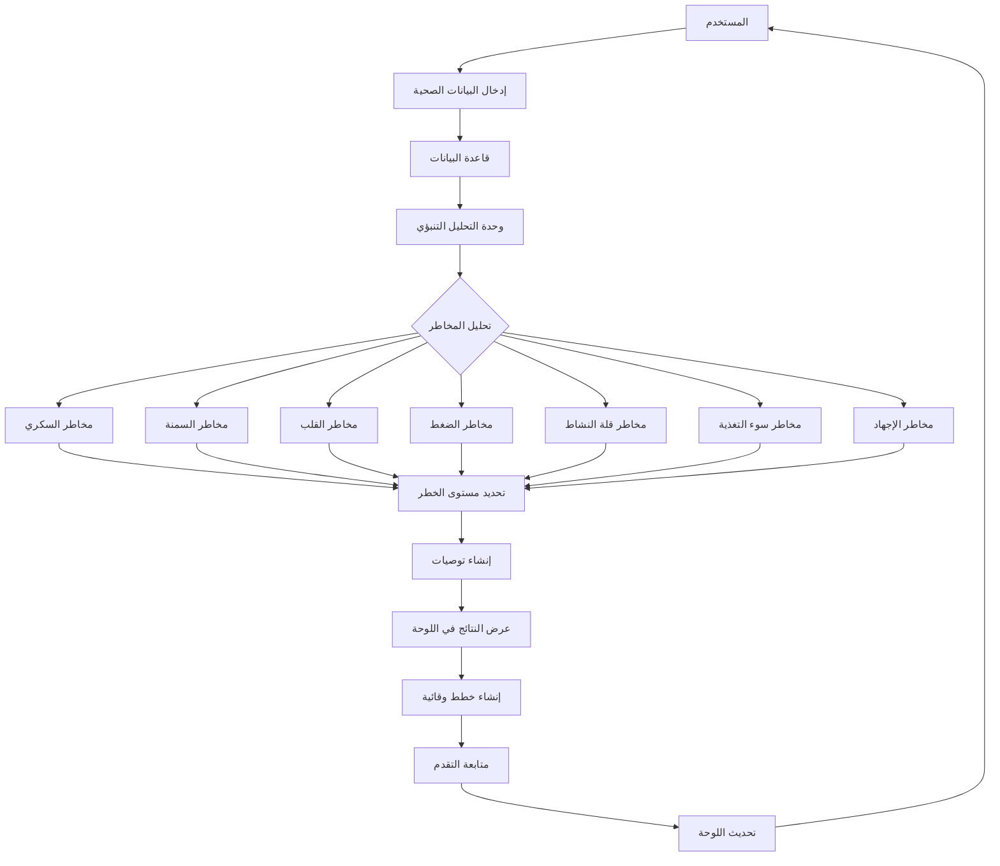
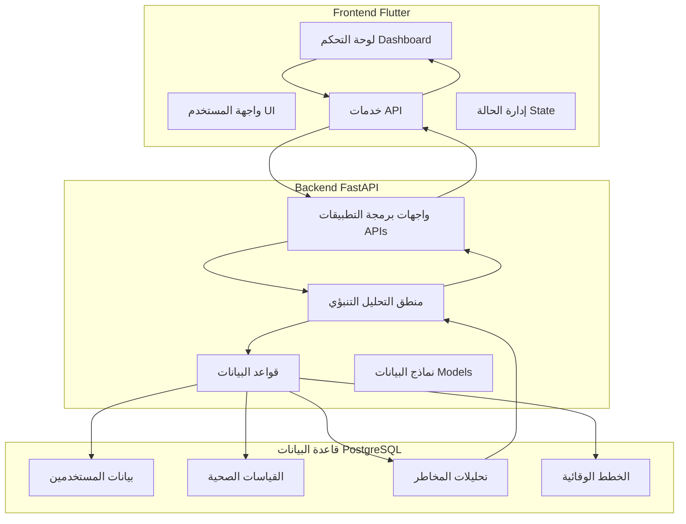
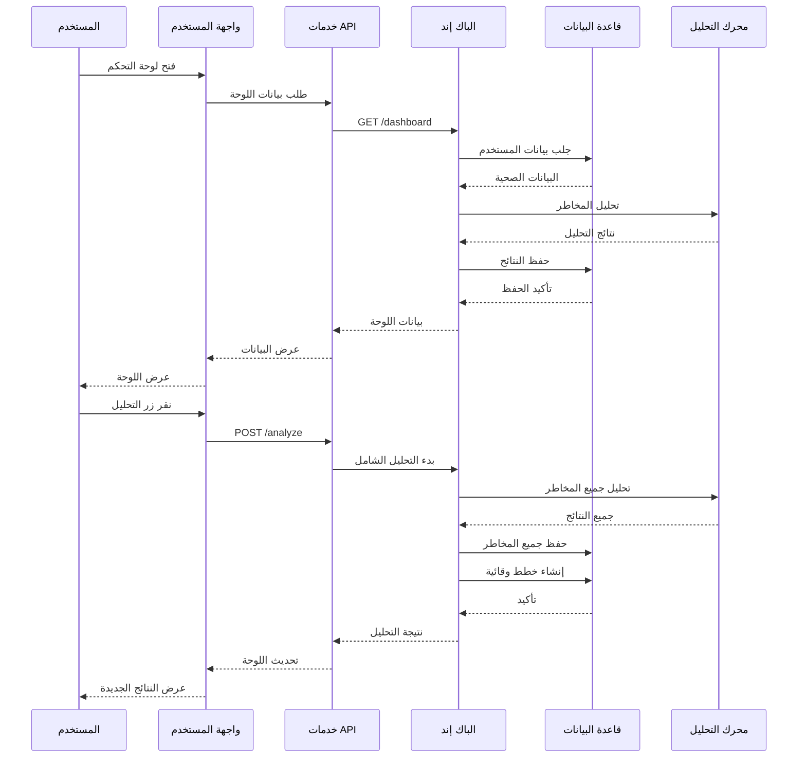
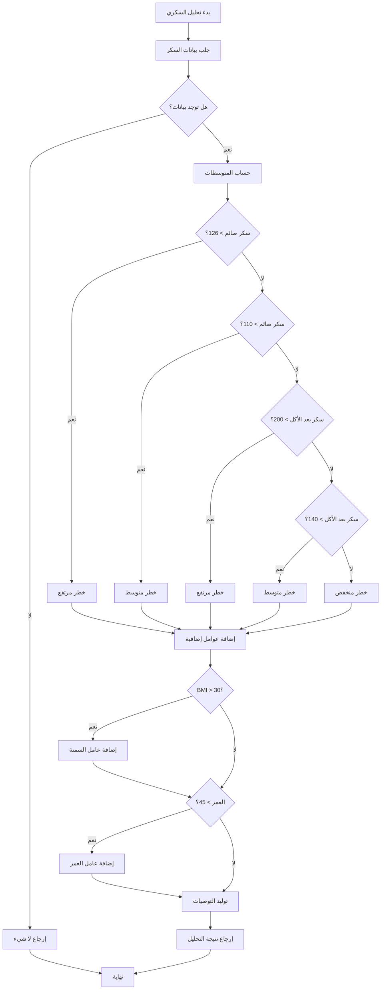
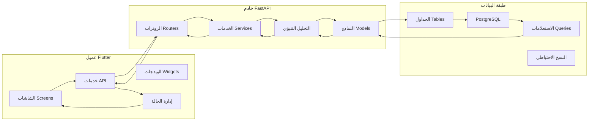
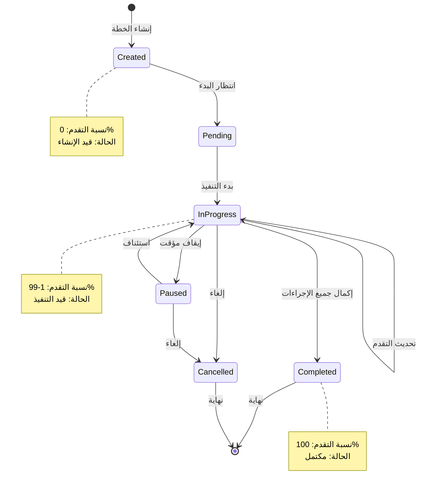

# مخططات نظام التحليل التنبؤي الوقائي

## 📊 مخطط تدفق النظام الكلي



## 🏗️ مخطط بنية التطبيق (Architecture)



## 🔄 مخطط تدفق البيانات (Data Flow)



## 🧠 مخطط منطق التحليل التنبؤي

```mermaid
flowchart LR
    subgraph Inputs [مدخلات البيانات]
        D1[بيانات التغذية]
        D2[قياسات السكر]
        D3[النشاط البدني]
        D4[التاريخ الصحي]
        D5[العوامل الديموغرافية]
    end
    
    subgraph Analysis [عمليات التحليل]
        A1[تحليل السكري]
        A2[تحليل السمنة]
        A3[تحليل القلب]
        A4[تحليل الضغط]
        A5[تحليل النشاط]
        A6[تحليل التغذية]
        A7[تحليل الإجهاد]
    end
    
    subgraph Scoring [نظام التقييم]
        S1[حساب الاحتمالية]
        S2[تحديد مستوى الخطر]
        S3[تجميع العوامل]
        S4[حساب الثقة]
    end
    
    subgraph Outputs [مخرجات النظام]
        O1[تقرير المخاطر]
        O2[التوصيات]
        O3[الخطط الوقائية]
        O4[مؤشرات التقدم]
    end
    
    Inputs --> Analysis
    Analysis --> Scoring
    Scoring --> Outputs
```



## 📱 مخطط واجهة لوحة التحكم

```mermaid
graph TD
    subgraph Dashboard [لوحة التحكم التنبؤية]
        Header[رأس الصفحة<br/>التنبؤ الوقائي]
        
        subgraph Stats [الإحصائيات السريعة]
            S1[إجمالي المخاطر]
            S2[مخاطر عالية]
            S3[خطط نشطة]
            S4[خطط مكتملة]
        end
        
        subgraph Risks [المخاطر الحديثة]
            R1[قائمة المخاطر]
            R2[مستوى الخطر]
            R3[نسبة الاحتمال]
            R4[التوصيات]
        end
        
        subgraph Plans [الخطط النشطة]
            P1[اسم الخطة]
            P2[الأولوية]
            P3[نسبة التقدم]
            P4[الإجراءات]
        end
        
        subgraph Charts [الرسوم البيانية]
            C1[توزيع المخاطر حسب النوع]
            C2[توزيع المخاطر حسب المستوى]
        end
        
        Controls[أزرار التحكم<br/>تحديث - تحليل]
    end
    
    Header --> Stats
    Stats --> Risks
    Risks --> Plans
    Plans --> Charts
    Charts --> Controls
```



## 🗂️ مخطط هيكل الملفات

```
e:/Flutter/hospital/
├── lib/
│   ├── screens/
│   │   └── predictive_prevention/
│   │       └── predictive_prevention_dashboard.dart    # لوحة التحكم الرئيسية
│   │
│   └── services/
│       └── predictive_prevention_api.dart             # خدمات التواصل مع الباك إند
│
├── back/
│   ├── routers/
│   │   └── predictive_prevention.py                   # واجهات برمجة التطبيقات
│   │
│   ├── models.py                                      # نماذج البيانات
│   └── database.py                                    # اتصال قاعدة البيانات
│
└── plans/
    └── predictive_prevention_diagrams.md              # هذا الملف
```

## ⚙️ مخطط تدفق تحليل المخاطر (مثال: السكري)



## 🔗 مخطط التكامل بين المكونات



## 📈 مخطط دورة حياة الخطة الوقائية



---

## 📋 ملخص المخططات

### 1. **مخطط تدفق النظام الكلي**
يظهر المسار الكامل من إدخال البيانات إلى عرض النتائج.

### 2. **مخطط بنية التطبيق**
يوضح العلاقة بين Frontend (Flutter)، Backend (FastAPI)، وقاعدة البيانات.

### 3. **مخطط تدفق البيانات**
يظهر تسلسل الأحداث عند تفاعل المستخدم مع النظام.

### 4. **مخطط منطق التحليل**
يشرح كيفية تحويل البيانات المدخلة إلى نتائج تنبؤية.

### 5. **مخطط واجهة لوحة التحكم**
يصور تخطيط واجهة المستخدم وعناصرها.

### 6. **مخطط هيكل الملفات**
يظهر تنظيم الكود في المشروع.

### 7. **مخطط تحليل المخاطر (مثال السكري)**
يشرح بالتفصيل خوارزمية تحليل أحد أنواع المخاطر.

### 8. **مخطط التكامل بين المكونات**
يوضح كيفية اتصال جميع أجزاء النظام.

### 9. **مخطط دورة حياة الخطة**
يظهر الحالات المختلفة للخطة الوقائية من الإنشاء إلى الإكمال.

---

## 🎯 الاستخدام العملي للمخططات

1. **لفهم النظام**: استخدم المخططات لفهم كيفية عمل النظام ككل
2. **للتطوير**: استخدم مخطط التدفق لإضافة ميزات جديدة
3. **لتصحيح الأخطاء**: استخدم مخطط تدفق البيانات لتتبع المشاكل
4. **للعرض**: استخدم مخطط الواجهة لتصميم تحسينات UI
5. **للتوثيق**: استخدم مخطط الهيكل لفهم تنظيم الكود

هذه المخططات تساعد المطورين والمستخدمين على فهم النظام التنبؤي بشكل مرئي وواضح.