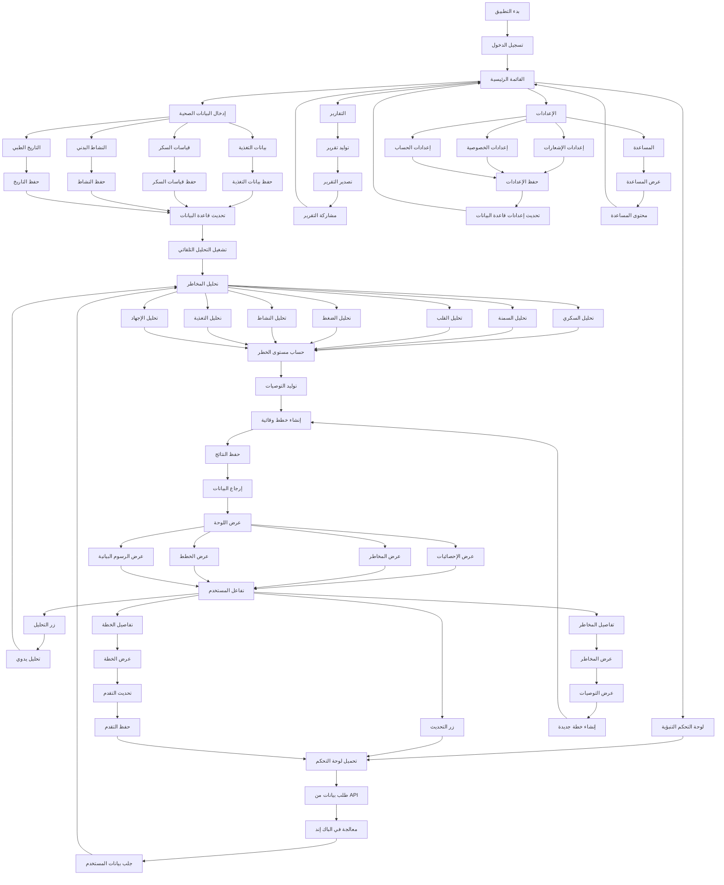
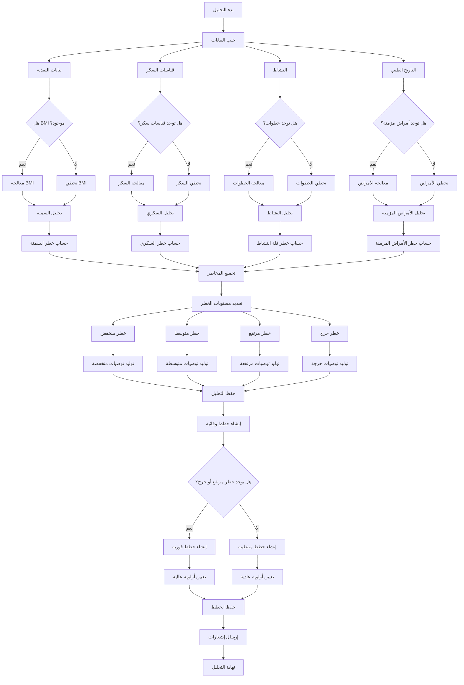
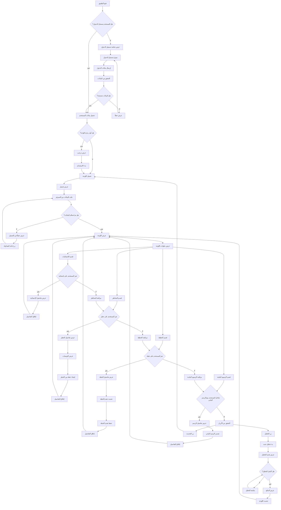

# Flow Chart للتطبيق التنبؤي الوقائي

## 📋 Flow Chart شامل للتطبيق



## 🔄 Flow Chart لتحليل المخاطر (تفصيلي)



## 📱 Flow Chart لتفاعل المستخدم مع اللوحة



## 🏥 Flow Chart لمسار مريض السكري

```mermaid
flowchart TD
    Patient[مريض السكري] --> EnterData[إدخال البيانات]
    
    EnterData --> BloodSugarReadings[قراءات السكر اليومية]
    EnterData --> FoodLog[سجل الطعام]
    EnterData --> ActivityLog[سجل النشاط]
    EnterData --> MedicationLog[سجل الأدوية]
    
    BloodSugarReadings --> UploadReadings[رفع القراءات]
    FoodLog --> UploadFood[رفع سجل الطعام]
    ActivityLog --> UploadActivity[رفع سجل النشاط]
    MedicationLog --> UploadMedication[رفع سجل الأدوية]
    
    UploadReadings --> SystemAnalysis[تحليل النظام]
    UploadFood --> SystemAnalysis
    UploadActivity --> SystemAnalysis
    UploadMedication --> SystemAnalysis
    
    SystemAnalysis --> CheckPatterns[التحقق من الأنماط]
    
    CheckPatterns --> HighFasting{سكر صائم مرتفع؟}
    HighFasting -->|نعم| FlagFasting[وضع علامة على الصائم المرتفع]
    HighFasting -->|لا| CheckPostMeal{سكر بعد الأكل مرتفع؟}
    
    FlagFasting --> CheckPostMeal
    
    CheckPostMeal -->|نعم| FlagPostMeal[وضع علامة على بعد الأكل المرتفع]
    CheckPostMeal -->|لا| CheckVariability{تقلبات كبيرة في السكر؟}
    
    FlagPostMeal --> CheckVariability
    
    CheckVariability -->|نعم| FlagVariability[وضع علامة على التقلبات]
    CheckVariability -->|لا| CheckTrends[التحقق من الاتجاهات]
    
    FlagVariability --> CheckTrends
    
    CheckTrends --> RisingTrend{اتجاه تصاعدي في السكر؟}
    RisingTrend -->|نعم| FlagRisingTrend[وضع علامة على الاتجاه التصاعدي]
    RisingTrend -->|لا| CheckCompliance{التزام بالعلاج؟}
    
    FlagRisingTrend --> CheckCompliance
    
    CheckCompliance --> GoodCompliance{التزام جيد؟}
    GoodCompliance -->|نعم| PositiveFeedback[تغذية راجعة إيجابية]
    GoodCompliance -->|لا| FlagNonCompliance[وضع علامة على عدم الالتزام]
    
    PositiveFeedback --> GenerateReport[توليد تقرير إيجابي]
    FlagNonCompliance --> GenerateAlert[توليد تنبيه]
    
    GenerateReport --> SendToPatient[إرسال للمريض]
    GenerateAlert --> SendAlert[إرسال التنبيه]
    
    SendToPatient --> PatientReview[مراجعة المريض]
    SendAlert --> UrgentAction[إجراء عاجل]
    
    PatientReview --> FollowRecommendations[اتباع التوصيات]
    UrgentAction --> ContactDoctor[الاتصال بالطبيب]
    
    FollowRecommendations --> ImproveHealth[تحسين الصحة]
    ContactDoctor --> AdjustTreatment[تعديل العلاج]
    
    ImproveHealth --> ReducedRisk[تقليل المخاطر]
    AdjustTreatment --> BetterControl[تحسين التحكم]
    
    ReducedRisk --> UpdateDashboard2[تحديث اللوحة]
    BetterControl --> UpdateDashboard2
    
    UpdateDashboard2 --> ShowImprovement[عرض التحسن]
    ShowImprovement --> ContinueMonitoring[متابعة المراقبة]
    
    ContinueMonitoring --> Patient
```



## 🔧 Flow Chart لإنشاء خطة وقائية

```mermaid
flowchart TD
    StartCreatePlan[بدء إنشاء خطة] --> SelectRisk[اختيار الخطر المستهدف]
    
    SelectRisk --> DiabetesRisk[خطر السكري]
    SelectRisk --> ObesityRisk[خطر السمنة]
    SelectRisk --> HeartRisk[خطر القلب]
    SelectRisk --> OtherRisk[خطر آخر]
    
    DiabetesRisk --> AnalyzeDiabetesNeeds[تحليل احتياجات السكري]
    ObesityRisk --> AnalyzeObesityNeeds[تحليل احتياجات السمنة]
    HeartRisk --> AnalyzeHeartNeeds[تحليل احتياجات القلب]
    OtherRisk --> AnalyzeOtherNeeds[تحليل احتياجات أخرى]
    
    AnalyzeDiabetesNeeds --> SetDiabetesGoals[تعيين أهداف السكري]
    AnalyzeObesityNeeds --> SetObesityGoals[تعيين أهداف السمنة]
    AnalyzeHeartNeeds --> SetHeartGoals[تعيين أهداف القلب]
    AnalyzeOtherNeeds --> SetOtherGoals[تعيين أهداف أخرى]
    
    SetDiabetesGoals --> CreateDiabetesActions[إنشاء إجراءات السكري]
    SetObesityGoals --> CreateObesityActions[إنشاء إجراءات السمنة]
    SetHeartGoals --> CreateHeartActions[إنشاء إجراءات القلب]
    SetOtherGoals --> CreateOtherActions[إنشاء إجراءات أخرى]
    
    CreateDiabetesActions --> SetDiabetesTimeline[تعيين جدول زمني]
    CreateObesityActions --> SetObesityTimeline[تعيين جدول زمني]
    CreateHeartActions --> SetHeartTimeline[تعيين جدول زمني]
    Create