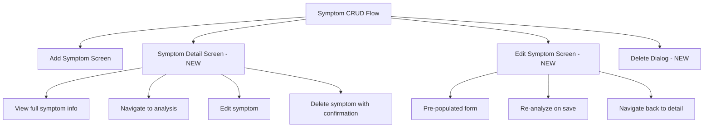
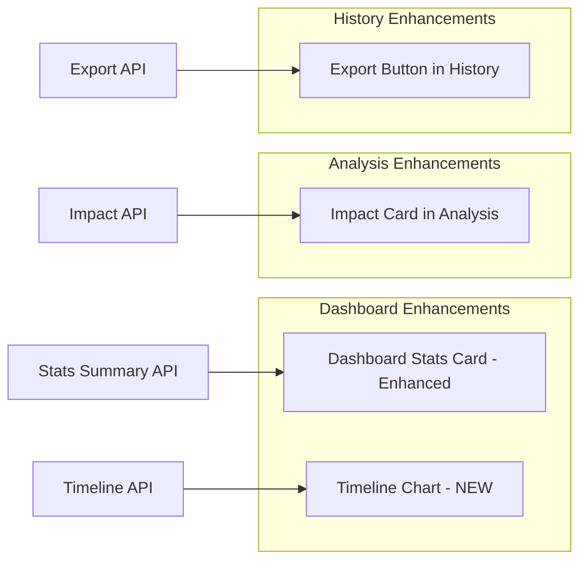
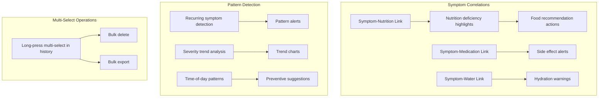

# Symptoms Module Development Plan

## Current State Analysis

### Existing Files
| File | Lines | Role |
|------|-------|------|
| `lib/screens/symptoms/add_symptom_screen.dart` | 657 | Add new symptom form |
| `lib/screens/symptoms/symptoms_dashboard.dart` | 862 | Dashboard with stats, recent symptoms, tips |
| `lib/screens/symptoms/symptom_analysis_screen.dart` | 801 | Analysis results display |
| `lib/screens/symptoms/symptom_history_screen.dart` | 908 | History with search, filter, list |
| `lib/services/symptom_api.dart` | 677 | 15 API methods |
| `lib/services/advanced_symptom_analysis.dart` | 852 | Local AI analysis with nutrition/medication/lifestyle |
| `lib/models/symptom_model.dart` | 99 | Symptom data model |
| `back/routers/symptoms.py` | 532 | 11 backend endpoints |

### Backend API Endpoints Available
| Endpoint | Method | Description | Used in UI? |
|----------|--------|-------------|-------------|
| `/api/symptoms/` | GET | List symptoms with filters | ✅ Yes |
| `/api/symptoms/{id}` | GET | Get symptom by ID | ✅ Yes |
| `/api/symptoms/` | POST | Create symptom with auto-analysis | ✅ Yes |
| `/api/symptoms/{id}` | PUT | Update symptom | ❌ **NO UI** |
| `/api/symptoms/{id}` | DELETE | Delete symptom | ❌ **NO UI** |
| `/api/symptoms/analyze` | POST | Analyze symptom | ✅ Yes |
| `/api/symptoms/impact` | GET | Symptom impact on walking/calories | ❌ **NOT USED** |
| `/api/symptoms/medicine-impact` | GET | Medicine impact + food recs | ✅ Used in advanced analysis |
| `/api/symptoms/stats/summary` | GET | Stats summary from server | ❌ **NOT USED** - dashboard calculates client-side |
| `/api/symptoms/stats/timeline` | GET | Time-of-day distribution | ❌ **NOT USED** |
| `/api/symptoms/{id}/food-recommendations` | GET | Food recs for specific symptom | ❌ **NOT USED** |

### Flutter Service Methods Available
| Method | Description | Used in UI? |
|--------|-------------|-------------|
| `getSymptoms()` | List with filters | ✅ Yes |
| `getSymptomById()` | Get single symptom | ✅ Yes |
| `addSymptom()` | Create symptom | ✅ Yes |
| `updateSymptom()` | Update symptom | ❌ **NO UI** |
| `deleteSymptom()` | Delete symptom | ❌ **NO UI** |
| `analyzeSymptom()` | Analyze symptom | ✅ Yes |
| `getSymptomImpact()` | Impact on walking | ❌ **NOT USED** |
| `getMedicineImpact()` | Medicine impact | ✅ In advanced analysis |
| `getSymptomsStats()` | Server-side stats | ❌ **NOT USED** |
| `getSymptomsTimeline()` | Time distribution | ❌ **NOT USED** |
| `searchSymptoms()` | Client-side search | ❌ **NOT USED** - history does local filter |
| `getSymptomTips()` | Tips for symptom | ❌ **NOT USED** |
| `deleteMultipleSymptoms()` | Bulk delete | ❌ **NO UI** |
| `exportSymptoms()` | Export as JSON | ❌ **NO UI** |
| `getSymptomsByDate()` | Get by date | ❌ **NOT USED** |

---

## Identified Gaps

### 🔴 Critical Gaps - Missing Screens/Features
1. **No Edit Symptom Screen** - `SymptomService.updateSymptom()` exists but no UI
2. **No Delete Symptom UI** - `SymptomService.deleteSymptom()` exists but no delete button/dialog anywhere
3. **No Symptom Detail Screen** - Tapping a symptom goes directly to analysis; no dedicated detail view
4. **Share button not implemented** - Analysis screen share button just shows snackbar
5. **Duplicated dead code** - `symptom_history_screen.dart` has `_buildFoodRecommendations()` method that is never called

### 🟡 API Integration Gaps - Backend APIs Not Used in UI
6. **Stats Summary API** - `getSymptomsStats()` returns server-side stats but dashboard calculates client-side
7. **Timeline API** - `getSymptomsTimeline()` returns time-of-day distribution but no UI shows this
8. **Tips API** - `getSymptomTips()` returns tips but dashboard uses hardcoded tips
9. **Symptom Impact API** - `getSymptomImpact()` returns impact on walking/calories but no UI
10. **Export API** - `exportSymptoms()` exists but no export button
11. **Bulk Delete API** - `deleteMultipleSymptoms()` exists but no multi-select UI

### 🟢 UX/Design Improvements
12. **Dashboard shows only 5 recent symptoms** - No pagination or show more
13. **No symptom correlation UI** - No visualization of symptom-nutrition-medication relationships
14. **No body location selector** - Symptoms could be tagged by body region
15. **No timeline visualization** - Timeline API data has no chart/heatmap UI
16. **No severity trend chart** - No visualization of severity changes over time
17. **Analysis screen is StatelessWidget** - Cannot refresh/re-analyze dynamically
18. **Advanced analysis results partially displayed** - `lifestyle_factors`, `nutritional_deficiencies`, `medication_effects` computed but not shown
19. **No search in dashboard** - Only history screen has search

---

## Development Phases

### Phase 1 - Critical Gap Fixes ⚡
**Priority: HIGH** - Core CRUD completeness

#### 1.1 Create Symptom Detail Screen
- **File**: `lib/screens/symptoms/symptom_detail_screen.dart`
- Full symptom information display: name, icon, severity, date/time, notes
- Analysis summary section with expandable details
- Food recommendations section
- Warning signs highlighted
- Action buttons: Edit, Delete, View Full Analysis, Share
- Delete confirmation dialog with severity-based warning
- Navigate from dashboard and history symptom card taps

#### 1.2 Create Edit Symptom Screen
- **File**: `lib/screens/symptoms/edit_symptom_screen.dart`
- Pre-populated form with existing symptom data
- Same UI pattern as `add_symptom_screen.dart` but with initial values
- Severity, date/time, notes editable
- Re-analyze option when saving changes
- Call `SymptomService.updateSymptom()` on save
- Navigate back to detail screen after save

#### 1.3 Add Delete Confirmation Dialog
- Integrated in detail screen and dashboard/history context menus
- Severity-aware warning messages: severe symptoms get stronger warnings
- Call `SymptomService.deleteSymptom()` on confirm
- Refresh parent screen after deletion

#### 1.4 Fix Dead Code in History Screen
- Remove duplicated `_buildFoodRecommendations()` method from `symptom_history_screen.dart`
- This method spans ~245 lines and is never called

#### 1.5 Update Dashboard & History Navigation
- Dashboard: tap symptom card → navigate to Detail Screen instead of Analysis Screen
- History: tap symptom card → navigate to Detail Screen instead of Analysis Screen
- Add context menu on long-press: Edit, Delete, View Analysis, Share

---

### Phase 2 - API Integration & Data Visualization 📊
**Priority: MEDIUM** - Leverage existing backend capabilities

#### 2.1 Use Server-Side Stats API in Dashboard
- Replace client-side `_calculateStats()` with `SymptomService.getSymptomsStats()`
- Display severity distribution as a pie/donut chart
- Show most frequent symptoms list from API
- Configurable period: 7, 30, 90 days

#### 2.2 Create Timeline Visualization
- Call `SymptomService.getSymptomsTimeline()` 
- Display as bar chart or circular chart showing symptom distribution by time of day
- Morning/Afternoon/Evening/Night periods with Arabic labels
- Add to dashboard as a new section

#### 2.3 Add Symptom Impact Section
- In analysis screen, call `SymptomService.getSymptomImpact()`
- Show impact on walking steps and calorie adjustment
- Display as info card with icon

#### 2.4 Add Export Functionality
- Add export button in history screen AppBar
- Call `SymptomService.exportSymptoms()`
- Save as JSON file or share via system share dialog
- Date range selection for export

#### 2.5 Display Advanced Analysis Results Fully
- In analysis screen, show sections for:
  - `nutritional_deficiencies` from `AdvancedSymptomAnalysis`
  - `medication_effects` from `AdvancedSymptomAnalysis`
  - `lifestyle_factors` from `AdvancedSymptomAnalysis`
- These are computed but currently not displayed in the UI

---

### Phase 3 - UX Enhancements & Search 🎨
**Priority: MEDIUM** - Better user experience

#### 3.1 Add Search to Dashboard
- Search bar at top of dashboard similar to activities dashboard
- Filter by symptom name
- Use `SymptomService.searchSymptoms()` or local filtering

#### 3.2 Dashboard Recent Symptoms Pagination
- Show more than 5 recent symptoms
- Add Show More button that navigates to history
- Or inline expansion: 5 → 10 → all

#### 3.3 Convert Analysis Screen to StatefulWidget
- Allow re-analysis/refresh
- Add pull-to-refresh
- Add re-analyze button that calls API again
- Better error handling and loading states

#### 3.4 Implement Share Functionality
- Replace snackbar placeholder with actual share
- Use `share_plus` package to share analysis text
- Format analysis as readable Arabic text
- Include food recommendations in shared content

#### 3.5 Add Body Location Selector in Add Screen
- Visual body map or grid selector: head, chest, abdomen, limbs, eyes, etc.
- Store as optional field in symptom data
- Display in detail and history screens
- Filter by body location in history

---

### Phase 4 - Advanced Features & Correlations 🔬
**Priority: LOW** - Future enhancements

#### 4.1 Symptom Correlation Dashboard Section
- Show relationships between symptoms and:
  - Nutrition deficiencies
  - Medication side effects
  - Water intake levels
- Use data from `AdvancedSymptomAnalysis`
- Visual correlation cards with actionable suggestions

#### 4.2 Pattern Detection & Alerts
- Detect recurring symptoms: same symptom 3+ times in a period
- Show pattern alert card in dashboard
- Suggest medical consultation for patterns
- Severity trend: is the same symptom getting worse over time?

#### 4.3 Multi-Select in History Screen
- Long-press to enter multi-select mode
- Checkbox on each symptom card
- Bulk actions toolbar: Delete Selected, Export Selected
- Call `deleteMultipleSymptoms()` for bulk delete

#### 4.4 Severity Trend Chart
- Line chart showing severity of a specific symptom over time
- Accessible from detail screen
- Uses existing symptom history data

#### 4.5 Smart Reminders
- Suggest tracking a symptom if it was reported around the same time previously
- Use timeline API data for time-based suggestions
- Notification reminders for recurring symptoms

---

## Phase Comparison Summary

| Phase | New Files | Modified Files | Key Deliverables |
|-------|-----------|----------------|------------------|
| Phase 1 | 2 | 3 | Detail Screen, Edit Screen, Delete Dialog, Remove dead code |
| Phase 2 | 0 | 3 | Stats API integration, Timeline chart, Impact card, Export, Advanced analysis display |
| Phase 3 | 0 | 3 | Dashboard search, Pagination, Share, Stateful analysis, Body location |
| Phase 4 | 0 | 2 | Correlations, Pattern detection, Multi-select, Trend charts, Reminders |

---

## Recommended Implementation Order

**Start with Phase 1** - it addresses the most critical gaps:
1. Symptom Detail Screen - central hub for viewing/editing/deleting
2. Edit Symptom Screen - completes the CRUD cycle
3. Delete Confirmation Dialog - essential data management
4. Remove dead code - clean up history screen
5. Update navigation flow - connect all new screens

This mirrors the approach taken with the Activities module where Phase 1 added the missing Detail Screen, Edit Screen, and Delete functionality.