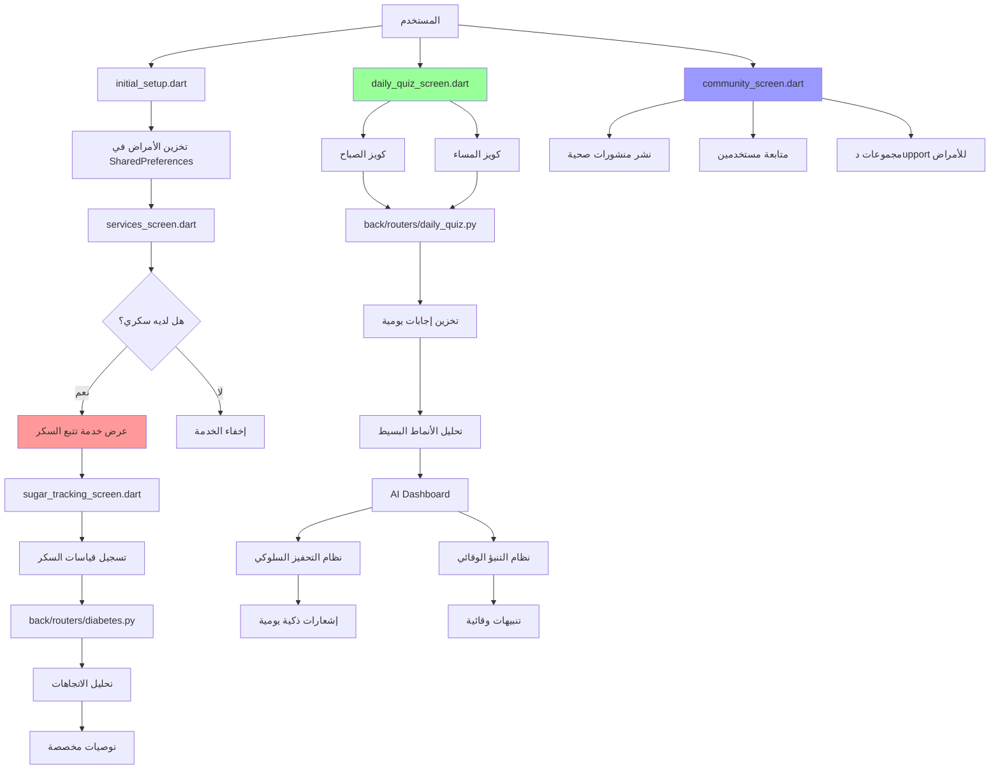

# خطة تحويل VITA إلى تطبيق صحي ذو قيمة حقيقية

## نظرة عامة
بناءً على تحليل المشروع الحالي، تم تحديد أن تطبيق VITA يحتوي على العديد من الميزات الأساسية ولكن يفتقر إلى القيمة الحقيقية التي تجعله تطبيقاً أساسياً للمستخدمين. هذه الخطة تقدم تحولاً شاملاً لإضافة قيمة حقيقية من خلال ميزات مخصصة للمستخدمين المصابين بأمراض مزمنة (مثل السكري) ونظام ذكي لفهم السلوك اليومي.

## التحليل الحالي

### الهيكل الحالي
1. **الواجهة الأمامية (Flutter/Dart)**:
   - `lib/screens/initial_setup.dart`: صفحة الإعداد الأولي مع اختيار الأمراض
   - `lib/screens/services_screen.dart`: شبكة الخدمات الصحية
   - نظام كويز موجود (`onboarding_quiz.dart`)

2. **الخلفية (FastAPI/Python)**:
   - نموذج `UserNutrition` يحتوي على حقل `diseases` (JSON)
   - نظام كويز كامل مع نماذج `QuizQuestion`, `QuizOption`, `QuizSession`
   - نظام تحليل AI موجود

3. **قاعدة البيانات**:
   - تخزين الأمراض كقائمة JSON في جدول `user_nutrition`
   - نظام كويز متكامل مع جداول منفصلة

## الميزات المطلوبة

### 1. نظام تتبع السكر للمرضى (Diabetes Tracking System)

#### المتطلبات الوظيفية:
- إضافة خدمة "تتبع السكر" في `services_screen.dart` تظهر فقط للمستخدمين المصابين بالسكري
- شاشة تتبع السكر مع:
  - تسجيل قياسات السكر (قبل/بعد الوجبات)
  - تتبع الأدوية المتعلقة بالسكري
  - تسجيل الأعراض المرتبطة
  - تحليل الاتجاهات والتنبيهات
  - توصيات غذائية مخصصة

#### التغييرات التقنية:
**الواجهة الأمامية:**
- إنشاء `sugar_tracking_screen.dart`
- تعديل `initial_setup.dart` لتخزين أمراض المستخدم في SharedPreferences
- تعديل `services_screen.dart` لإظهار خدمة تتبع السكر بناءً على الأمراض المخزنة

**الخلفية:**
- إنشاء `routers/diabetes.py` مع نقاط نهاية:
  - `POST /api/diabetes/measurements` - تسجيل قياسات السكر
  - `GET /api/diabetes/history` - سجل القياسات
  - `GET /api/diabetes/analysis` - تحليل الاتجاهات
- إنشاء `models/diabetes.py` مع نماذج:
  - `BloodSugarMeasurement`
  - `DiabetesMedication`
  - `DiabetesSymptom`

### 2. كويز الصباح والمساء (Morning/Evening Daily Quiz) - نظام مستقل

#### المتطلبات الوظيفية:
- نظام كويز يومي **مستقل تماماً** عن نظام الكويز الشهري الحالي
- كويز صباحي بسيط (3-5 أسئلة) يركز على:
  - جودة النوم (نمتَ كام ساعة؟)
  - الحالة عند الاستيقاظ (صاحي كويس ولا لا؟)
  - مستوى الطاقة (حاسس بتعب؟)
  - الخطط الصحية اليومية
- كويز مسائي بسيط (3-5 أسئلة) يركز على:
  - التعب خلال اليوم (حسيت بتعب في اليوم؟)
  - الأعراض التي ظهرت (أي عرض جديد؟)
  - الإنجازات الصحية (ماذا أنجزت؟)
  - التحديات اليومية (ما هي الصعوبات؟)

#### التغييرات التقنية:
**نظام جديد كامل (لا علاقة بنظام الكويز الحالي):**
- إنشاء نماذج جديدة كاملة في `back/models/daily_quiz.py`:
  - `DailyQuizQuestion` (أسئلة الكويز اليومي)
  - `DailyQuizAnswer` (إجابات المستخدم)
  - `DailyQuizSession` (جلسة الكويز اليومية)
- إنشاء `back/routers/daily_quiz.py` مع نقاط نهاية منفصلة
- نظام تخزين بسيط في قاعدة بيانات منفصلة أو جدول جديد

**خصائص النظام الجديد:**
- أسئلة ثابتة وبسيطة (لا تحتاج لتعديل)
- إجابات سريعة (اختيار من متعدد أو مقياس)
- لا يوجد تحليل معقد - فقط تسجيل للأنماط
- يمكن التكامل لاحقاً مع نظام التحليل

**الواجهة الأمامية:**
- إنشاء `daily_quiz_screen.dart` **جديد تماماً**
- تصميم بسيط وسريع (شاشة واحدة)
- إشعارات تذكيرية يومية منفصلة
- عرض بسيط للإجابات السابقة

### 3. مجتمع الصحي التفاعلي (Health Community)

#### المتطلبات الوظيفية:
- نظام مشابه لتويتر للمحتوى الصحي
- المستخدمين يمكنهم:
  - نشر تحديثات صحية (نصوص، صور، فيديوهات قصيرة)
  - التفاعل مع المنشورات (إعجاب، تعليق، مشاركة)
  - متابعة مستخدمين آخرين
  - الانضمام لمجموعات دعم حسب الأمراض
  - المشاركة في تحديات صحية جماعية

#### التغييرات التقنية:
**الخلفية:**
- إنشاء `routers/community.py`
- إنشاء `models/community.py` مع:
  - `CommunityPost`
  - `PostLike`
  - `PostComment`
  - `UserFollow`
  - `SupportGroup`

**الواجهة الأمامية:**
- إنشاء `community_screen.dart`
- إنشاء `create_post_screen.dart`
- إنشاء `post_detail_screen.dart`

### 4. دمج التحليل المتكامل مع AI Dashboard

#### المتطلبات الوظيفية:
- ربط بيانات الكويز اليومي مع التحليل AI
- توليد رؤى ذكية بناءً على:
  - أنماط النوم اليومية
  - تقلبات الطاقة
  - العلاقة بين الأعراض والسلوك
  - تأثير الأمراض المزمنة على الحياة اليومية

#### التغييرات التقنية:
- توسيع `ai_dashboard.dart` لعرض:
  - تحليل الأنماط اليومية
  - توصيات مبنية على بيانات الكويز
  - تنبؤات بالصحة بناءً على الاتجاهات
- إنشاء `daily_patterns_analysis.dart`

### 5. نظام التحفيز السلوكي الذكي (Smart Behavioral Nudges)

#### المتطلبات الوظيفية:
- نظام إشعارات ذكي بناءً على:
  - بيانات الكويز اليومي
  - أنماط المستخدم
  - الأمراض المزمنة
  - الأهداف الصحية
- أمثلة على التحفيزات:
  - "لاحظنا أنك متعب اليوم، جرب تمارين التنفس"
  - "مستوى السكر مرتفع، تذكر شرب الماء"
  - "أنت تتقدم نحو هدفك، استمر!"

#### التغييرات التقنية:
- إنشاء `services/nudge_service.dart`
- إنشاء `models/nudge_rules.py`
- دمج مع نظام الإشعارات الحالي

### 6. نظام التنبؤ الوقائي (Predictive Prevention)

#### المتطلبات الوظيفية:
- تحليل البيانات التاريخية للتنبؤ بـ:
  - نوبات ارتفاع/انخفاض السكر
  - فترات التعب الشديد
  - احتمالية ظهور أعراض جديدة
  - الحاجة إلى زيارة طبية
- إنشاء "درجة الوقاية" للمستخدم

#### التغييرات التقنية:
- إنشاء `ml/health_predictor.py`
- إنشاء `routers/predictions.py`
- عرض التنبؤات في `ai_dashboard.dart`

## خطة التنفيذ المرحلية

### المرحلة 1: الأساسيات (أسبوع 1-2)
1. **نظام تتبع السكر**:
   - إنشاء نماذج قاعدة البيانات للقياسات (`back/models/diabetes.py`)
   - تطوير واجهة تسجيل القياسات (`sugar_tracking_screen.dart`)
   - دمج مع نظام الأمراض الحالي في `initial_setup.dart`

2. **كويز الصباح والمساء (نظام مستقل)**:
   - إنشاء نماذج جديدة كاملة (`back/models/daily_quiz.py`)
   - تطوير واجهة الكويز اليومي (`daily_quiz_screen.dart`)
   - إضافة إشعارات تذكيرية يومية

### المرحلة 2: الذكاء (أسبوع 3-4)
3. **دمج التحليل مع AI Dashboard**:
   - تطوير تحليل الأنماط اليومية من بيانات الكويز
   - عرض الرؤى في لوحة التحكم
   - إنشاء تقارير أسبوعية بسيطة

4. **نظام التحفيز السلوكي**:
   - تطوير قواعد تحفيز بسيطة بناءً على بيانات الكويز
   - دمج مع نظام الإشعارات الحالي
   - اختبار فعالية التحفيزات

### المرحلة 3: المجتمع (أسبوع 5-6)
5. **مجتمع الصحي التفاعلي**:
   - تطوير نظام المنشورات والتفاعل
   - إنشاء واجهة المجتمع
   - إضافة مجموعات دعم للأمراض المزمنة

6. **نظام التنبؤ الوقائي**:
   - تطوير نماذج تنبؤ بسيطة
   - دمج مع البيانات التاريخية
   - عرض تنبيهات وقائية

### المرحلة 4: التحسين (أسبوع 7-8)
7. **اختبار وتحسين**:
   - اختبار المستخدمين للميزات الجديدة
   - تحسين الأداء والتجربة
   - إضافة تحسينات بناءً على التغذية الراجعة

## المخطط التقني

## ملفات جديدة مطلوبة

### الواجهة الأمامية (Flutter):
1. `lib/screens/diabetes/sugar_tracking_screen.dart`
2. `lib/screens/diabetes/sugar_history_screen.dart`
3. `lib/screens/diabetes/sugar_analysis_screen.dart`
4. `lib/screens/daily_quiz/daily_quiz_screen.dart` (نظام جديد مستقل)
5. `lib/screens/daily_quiz/daily_quiz_history.dart`
6. `lib/screens/community/community_screen.dart`
7. `lib/screens/community/create_post_screen.dart`
8. `lib/screens/community/post_detail_screen.dart`
9. `lib/screens/analysis/daily_patterns_analysis.dart`

### الخلفية (Python):
1. `back/routers/diabetes.py`
2. `back/routers/daily_quiz.py` (نظام جديد مستقل)
3. `back/routers/community.py`
4. `back/routers/predictions.py`
5. `back/models/diabetes.py`
6. `back/models/daily_quiz.py` (نماذج جديدة مستقلة)
7. `back/models/community.py`
8. `back/models/nudge_rules.py`
9. `back/ml/health_predictor.py`
10. `back/services/nudge_service.py`

## الاعتبارات التقنية

### إدارة الحالة:
- استخدام `SharedPreferences` لتخزين أمراض المستخدم محلياً
- استخدام `Provider` لإدارة حالة خدمة تتبع السكر
- تحديث `services_screen.dart` بناءً على الأمراض المخزنة
- نظام الكويز اليومي مستقل تماماً عن نظام الكويز الشهري

### فصل الأنظمة:
- **نظام الكويز الشهري الحالي**: يبقى كما هو (`onboarding_quiz.dart`)
- **نظام الكويز اليومي الجديد**: نظام مستقل كامل (`daily_quiz_screen.dart`)
- لا يوجد تداخل أو اعتماد بين النظامين
- كل نظام له نماذج وقواعد بيانات خاصة به

### الأداء:
- نظام الكويز اليومي بسيط وسريع (3-5 أسئلة)
- التحميل الفوري للأسئلة (لا حاجة لاستدعاء API معقد)
- تخزين محلي للإجابات اليومية
- مزامنة بسيطة مع الخادم

### الأمان:
- التحقق من صلاحية المستخدم للوصول لبيانات السكر
- حماية بيانات المجتمع من الوصول غير المصرح به
- تشفير البيانات الحساسة للقياسات
- بيانات الكويز اليومي غير حساسة (يمكن تخزينها بشكل آمن)

## القيمة المضافة المتوقعة

### للمستخدمين المصابين بالسكري:
- نظام تتبع متكامل ومخصص
- توصيات غذائية ذكية
- تنبيهات مبكرة للمشاكل
- دعم مجتمعي من مرضى آخرين

### لجميع المستخدمين:
- فهم أعمق للسلوك اليومي
- تحفيز مستمر لتحسين الصحة
- مجتمع داعم ومحفز
- تنبؤات وقائية ذكية

### للتطبيق بشكل عام:
- تمييز حقيقي عن التطبيقات المنافسة
- زيادة معدل الاحتفاظ بالمستخدمين
- تحسين تجربة المستخدم بشكل كبير
- قاعدة مستخدمين مخلصين ومتفاعلين

## الخطوات التالية

1. **مراجعة الخطة** من قبل الفريق
2. **بدء التنفيذ** بالمرحلة الأولى (نظام تتبع السكر)
3. **اختبار كل ميزة** قبل الانتقال للمرحلة التالية
4. **جمع التغذية الراجعة** من المستخدمين المبكرين
5. **التكرار والتحسين** بناءً على النتائج

---

**ملاحظة**: هذه الخطة قابلة للتعديل بناءً على التغذية الراجعة والمتطلبات الجديدة التي تظهر خلال التنفيذ.